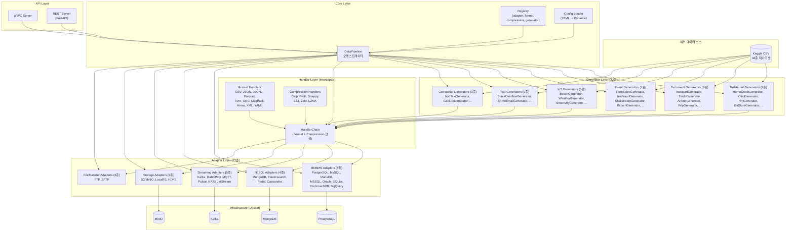
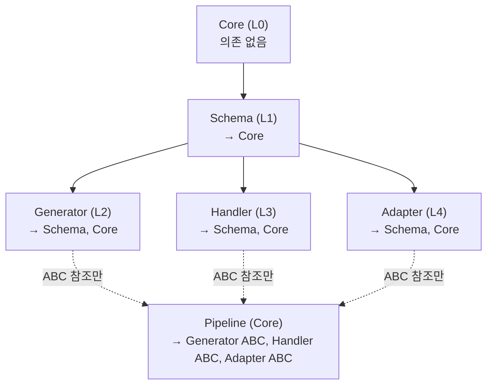

# 01. 시스템 아키텍처

> 계층화된 파이프라인 아키텍처 — Registry, Interceptor, Adapter 패턴의 조합

---

## 목차

1. [전체 시스템 구성도](#1-전체-시스템-구성도)
2. [계층 구조](#2-계층-구조)
3. [설계 원칙](#3-설계-원칙)
4. [의존성 방향](#4-의존성-방향)
5. [확장성 설계](#5-확장성-설계)
6. [관련 문서](#6-관련-문서)

---

## 1. 전체 시스템 구성도

### 1.1 시스템 개요 다이어그램



### 1.2 단순화된 파이프라인 흐름

```
┌─────────────┐     ┌──────────────┐     ┌─────────────┐
│  Generator   │────▶│ HandlerChain │────▶│   Adapter   │
│ (데이터 생성) │     │ (변환 + 압축)  │     │  (인프라 적재) │
└─────────────┘     └──────────────┘     └─────────────┘
       │                    │                    │
   CSV 원본 읽기       Format encode        push(bytes)
   DataRecord 생성     Compression compress  인프라별 적재
```

---

## 2. 계층 구조

### 2.1 5-Layer Architecture

```mermaid
graph LR
    subgraph L0["Layer 0: Core"]
        direction TB
        Registry
        Config
        Pipeline
        Enums
        Exceptions
    end

    subgraph L1["Layer 1: Schema"]
        direction TB
        DataRecord
        GeneratorConfig
        AdapterConfig
        HandlerConfig
        PipelineConfig
    end

    subgraph L2["Layer 2: Generator"]
        direction TB
        BaseGenerator
        RDBMSGenerators
        NoSQLGenerators
        StreamGenerators
    end

    subgraph L3["Layer 3: Handler"]
        direction TB
        BaseFormatHandler
        BaseCompressionHandler
        HandlerChain
    end

    subgraph L4["Layer 4: Adapter"]
        direction TB
        BaseAdapter
        CategoryBases
        ConcreteAdapters
    end

    L0 --> L1
    L1 --> L2 & L3 & L4
    L2 --> L3
    L3 --> L4
```



### 2.2 각 계층의 책임

| 계층 | 책임 | 핵심 컴포넌트 |
|------|------|--------------|
| **Core (L0)** | 프레임워크 인프라 — 레지스트리, 설정 로딩, 파이프라인 오케스트레이션 | `Registry`, `ConfigLoader`, `DataPipeline` |
| **Schema (L1)** | 데이터 모델 — Pydantic v2 기반 타입 안전한 설정과 레코드 | `DataRecord`, `*Config`, `*Schema` |
| **Generator (L2)** | 데이터 생성 — 정적 CSV를 동적 데이터 소스로 변환 | `BaseGenerator`, 32종 구현체 |
| **Handler (L3)** | 데이터 변환 — 포맷 인코딩 + 압축을 파이프라인에서 분리 | `HandlerChain`, 10종 포맷, 6종 압축 |
| **Adapter (L4)** | 인프라 적재 — 대상 시스템에 데이터 전송 | `BaseAdapter`, 22종 구현체 |

### 2.3 디렉토리 구조

```
src/demiurge_testdata/
├── __init__.py
├── core/                      # Layer 0
│   ├── __init__.py
│   ├── registry.py            # Generic Registry 클래스
│   ├── config.py              # YAML → Pydantic 로더
│   ├── pipeline.py            # DataPipeline 오케스트레이터
│   ├── enums.py               # AdapterType, FormatType 등
│   └── exceptions.py          # 프로젝트 공통 예외
├── schemas/                   # Layer 1
│   ├── __init__.py
│   ├── record.py              # DataRecord 모델
│   ├── config.py              # 설정 스키마들
│   └── datasets/              # 데이터셋별 Pydantic 모델
│       ├── home_credit.py
│       ├── olist.py
│       └── ...
├── generators/                # Layer 2
│   ├── __init__.py
│   ├── base.py                # BaseGenerator ABC
│   ├── relational/            # Category A: Relational (8종)
│   ├── document/              # Category B: Document (6종)
│   ├── event/                 # Category C: Event Stream (7종)
│   ├── iot/                   # Category D: Time-Series/IoT (5종)
│   ├── text/                  # Category E: Text (3종)
│   └── geospatial/            # Category F: Geospatial (3종)
├── handlers/                  # Layer 3
│   ├── __init__.py
│   ├── base.py                # BaseFormatHandler, BaseCompressionHandler ABC
│   ├── chain.py               # HandlerChain 합성기
│   ├── formats/               # 10종 포맷 핸들러
│   └── compression/           # 6종 압축 핸들러
├── adapters/                  # Layer 4
│   ├── __init__.py
│   ├── base.py                # BaseAdapter ABC
│   ├── rdbms/                 # RDBMS 카테고리 (8종)
│   ├── nosql/                 # NoSQL 카테고리 (4종)
│   ├── streaming/             # Streaming 카테고리 (5종)
│   ├── storage/               # Storage 카테고리 (3종)
│   └── filetransfer/          # FileTransfer 카테고리 (2종)
├── storage/                   # 스토리지 추상화
│   └── backend.py
└── api/                       # API 서빙
    ├── grpc/
    └── rest/
```

---

## 3. 설계 원칙

### 3.1 Registry 패턴 — 왜 선택했는가

**문제**: 22개 어댑터 + 10종 포맷 + 6종 압축 + 32종 제너레이터 = 70개 구현체를 어떻게 관리하는가?

**대안 비교**:

| 접근법 | 장점 | 단점 |
|--------|------|------|
| 직접 import | 단순 | 새 구현체 추가 시 여러 파일 수정 |
| 카테고리별 Factory | 타입 안전 | Factory 클래스 4개 필요, 중복 코드 |
| **Generic Registry** | **단일 클래스로 모든 카테고리 처리** | **문자열 키 의존** |

**선택 근거**: 하나의 `Registry` 클래스로 4개 카테고리를 모두 관리한다. 데코레이터 기반 자동 등록으로 새 구현체 추가 시 **기존 코드 변경이 불필요**하다.

```python
# 등록: 데코레이터 한 줄
@adapter_registry.register("postgresql")
class PostgreSQLAdapter(BaseRDBMSAdapter): ...

# 사용: 문자열 키로 인스턴스 생성
adapter = adapter_registry.create("postgresql", config=pg_config)
```

**4개 레지스트리 인스턴스**:
- `adapter_registry` — 22개 어댑터
- `format_registry` — 10종 포맷 핸들러
- `compression_registry` — 6종 압축 알고리즘 (cramjam 통합, + `none`)
- `generator_registry` — 32종 제너레이터

### 3.2 Interceptor 패턴 — 왜 선택했는가

**문제**: 10종 포맷 × 7종 압축(none 포함) = 70가지 조합을 어떻게 처리하는가?

**대안 비교**:

| 접근법 | 클래스 수 | 유지보수성 |
|--------|----------|-----------|
| 조합별 클래스 | 70개 | 새 포맷 추가 시 7개 클래스 생성 |
| 상속 체인 | ~20개 | 다이아몬드 상속, 복잡한 MRO |
| **Interceptor (합성)** | **11개** | **새 포맷 = 1개 클래스** |

**선택 근거**: `HandlerChain`이 Format과 Compression을 독립적으로 합성한다. 각 핸들러는 단일 책임(SRP)을 유지하며, 조합은 런타임에 결정된다.

```python
# 11개 클래스로 70가지 조합 지원 — 6종 압축 알고리즘 (cramjam 통합)
chain = HandlerChain(
    format_handler=ParquetFormatHandler(),
    compression_handler=CramjamCompressionHandler("lz4")
)
encoded = await chain.encode(records)   # Parquet 인코딩 → LZ4 압축
decoded = await chain.decode(encoded)   # LZ4 해제 → Parquet 디코딩
```

### 3.3 Adapter 패턴 — 왜 선택했는가

**문제**: PostgreSQL과 Kafka는 전혀 다른 프로토콜을 사용하지만, 파이프라인은 둘을 동일하게 취급해야 한다.

**설계 결정**: 모든 어댑터는 `bytes`를 받는다. Handler가 이미 직렬화+압축을 완료했으므로, 어댑터는 전송에만 집중한다.

```
Pipeline 관점:  adapter.push(bytes, metadata)
               → PostgreSQL: INSERT INTO ... (BYTEA)
               → Kafka: producer.send(topic, bytes)
               → MinIO: put_object(bucket, key, bytes)
```

**3단계 계층**:
1. `BaseAdapter` — 모든 어댑터의 공통 인터페이스 (connect, push, fetch, health_check)
2. Category Base — 카테고리별 확장 메서드 (BaseRDBMSAdapter → execute_sql, bulk_insert)
3. Concrete — 실제 구현 (PostgreSQLAdapter → asyncpg 연동)

### 3.4 Async-First 원칙

**왜 모든 인터페이스가 async인가**:

- 22개 어댑터 모두 네트워크 I/O 기반 → asyncio가 자연스러운 선택
- 스트리밍 모드에서 Generator가 비동기 이터레이터로 데이터를 생산
- CPU-bound 작업(Parquet 인코딩 등)은 `asyncio.to_thread()` 또는 `ProcessPoolExecutor`로 오프로드

```python
# 모든 레이어가 async
async def run_pipeline():
    async with adapter:                          # 비동기 컨텍스트
        async for record in generator.stream():  # 비동기 이터레이터
            encoded = await chain.encode(record)  # 비동기 인코딩
            await adapter.push(encoded, meta)     # 비동기 적재
```

---

## 4. 의존성 방향

### 4.1 계층 간 의존 규칙



### 4.2 추상화 경계

| 경계 | 규칙 |
|------|------|
| Pipeline → Generator | `BaseGenerator` ABC만 참조, 구체 클래스 모름 |
| Pipeline → Handler | `HandlerChain` 인터페이스만 참조 |
| Pipeline → Adapter | `BaseAdapter` ABC만 참조 |
| Generator → 외부 라이브러리 | pandas/csv만 사용, 어댑터 라이브러리 사용 금지 |
| Handler → 어댑터 | 핸들러는 어댑터의 존재를 모름 |
| Adapter → 핸들러 | 어댑터는 핸들러의 존재를 모름 (bytes만 수신) |

### 4.3 의존성 역전 (Dependency Inversion)

Pipeline은 구체 클래스가 아닌 **추상에 의존**한다:

```python
class DataPipeline:
    def __init__(
        self,
        generator: BaseGenerator,      # ABC
        handler_chain: HandlerChain,    # 합성 인터페이스
        adapter: BaseAdapter,           # ABC
        batch_size: int = 1000,
    ): ...
```

Registry가 YAML 설정에서 문자열 키를 읽어 구체 인스턴스를 생성하므로, Pipeline은 **어떤 Generator·Handler·Adapter가 사용되는지 모른다**.

---

## 5. 확장성 설계

### 5.1 새 어댑터 추가

**변경 범위**: 파일 1개 생성 + 데코레이터 1줄

```python
# adapters/nosql/couchdb.py (새 파일)
from demiurge_testdata.adapters.base import BaseNoSQLAdapter
from demiurge_testdata.core.registry import adapter_registry

@adapter_registry.register("couchdb")
class CouchDBAdapter(BaseNoSQLAdapter):
    async def connect(self) -> None: ...
    async def push(self, data: bytes, metadata: dict) -> None: ...
    # ...
```

**기존 코드 변경**: 없음. Registry에 자동 등록되며, YAML 설정에서 `adapter.type: couchdb`로 즉시 사용 가능.

### 5.2 새 포맷 핸들러 추가

**변경 범위**: 파일 1개 생성 + 데코레이터 1줄

```python
# handlers/formats/protobuf.py (새 파일)
@format_registry.register("protobuf")
class ProtobufFormatHandler(BaseFormatHandler):
    async def encode(self, records: list[dict]) -> bytes: ...
    async def decode(self, data: bytes) -> list[dict]: ...
```

**자동 효과**: 기존 6종 압축과 모두 조합 가능 (7가지 새 조합 추가)

### 5.3 새 데이터셋 추가

**변경 범위**: 스키마 파일 1개 + 제너레이터 파일 1개

```
schemas/datasets/new_dataset.py    → Pydantic 모델 정의
generators/[category]/new_gen.py   → @generator_registry.register("new_dataset")
```

### 5.4 확장 시 불변 요소

확장 시 다음 코드는 **절대 수정하지 않는다** (Open/Closed Principle):

- `core/registry.py` — Generic Registry 클래스
- `core/pipeline.py` — DataPipeline 오케스트레이터
- `handlers/chain.py` — HandlerChain 합성기
- `adapters/base.py` — BaseAdapter ABC

---

## 6. 관련 문서

| 문서 | 내용 |
|------|------|
| [00-프로젝트-개요](./00-프로젝트-개요.md) | 비전, 목표, 기술 스택 |
| [02-데이터-흐름](./02-데이터-흐름.md) | 파이프라인 실행 모드와 데이터 변환 과정 |
| [03-어댑터-설계](./03-어댑터-설계.md) | Adapter 계층의 상세 설계 |
| [04-핸들러-설계](./04-핸들러-설계.md) | Interceptor 패턴의 상세 설계 |
| [05-제너레이터-설계](./05-제너레이터-설계.md) | Generator 계층의 상세 설계 |
