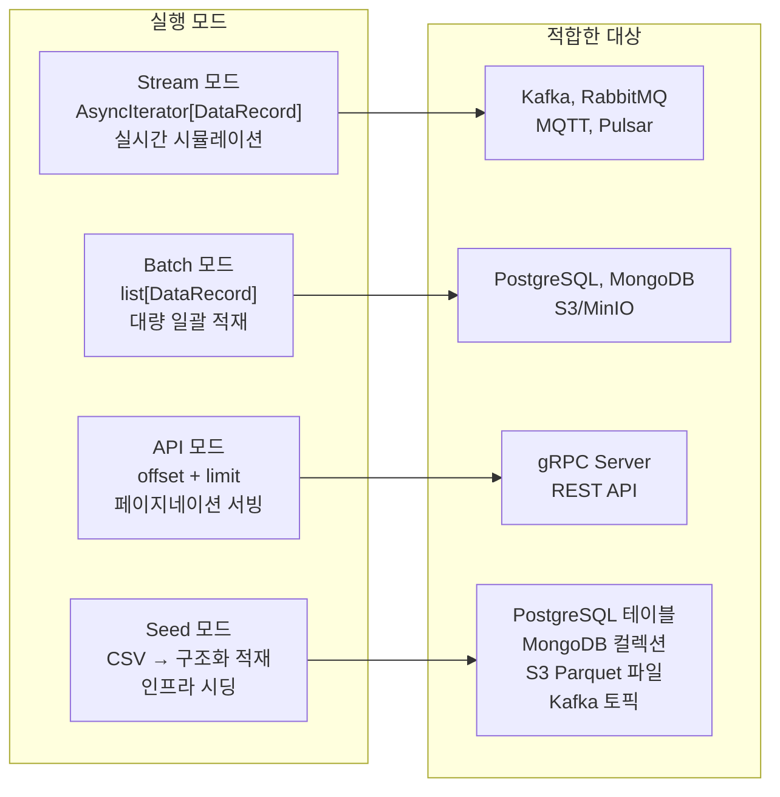
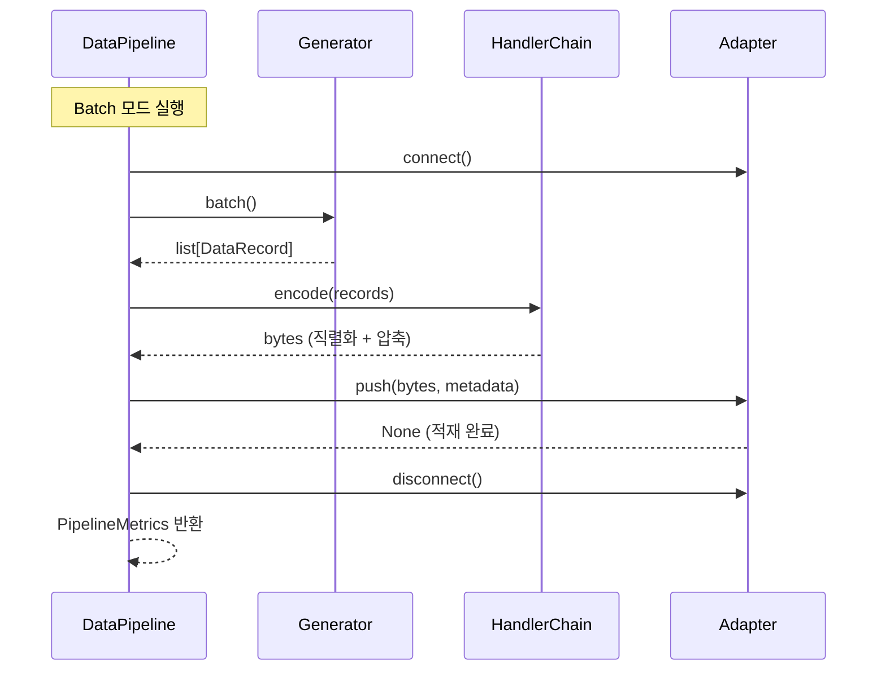
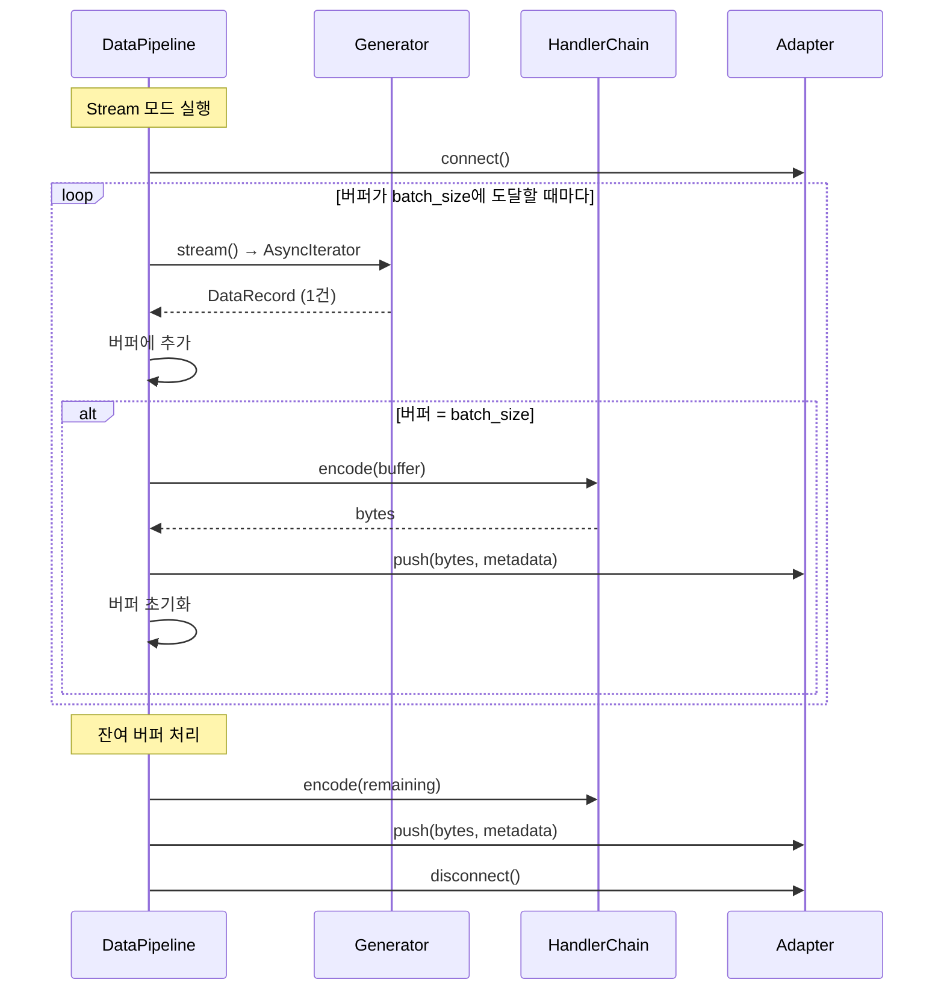
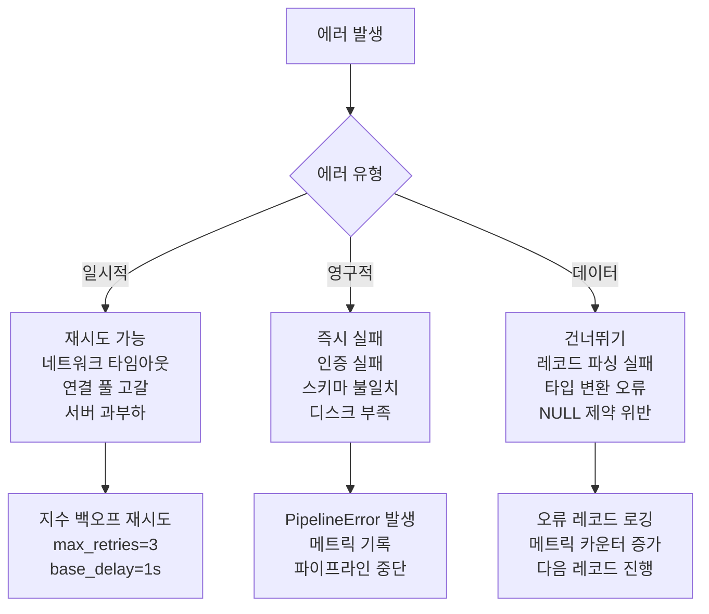

# 02. 데이터 흐름

> Generator → HandlerChain → Adapter — 3가지 모드로 실행되는 데이터 파이프라인

---

## 목차

1. [4가지 실행 모드](#1-4가지-실행-모드)
2. [파이프라인 오케스트레이션](#2-파이프라인-오케스트레이션)
3. [데이터 변환 체인](#3-데이터-변환-체인)
4. [에러 핸들링과 재시도 전략](#4-에러-핸들링과-재시도-전략)
5. [메트릭 수집](#5-메트릭-수집)
6. [관련 문서](#6-관련-문서)

---

## 1. 4가지 실행 모드

### 1.1 모드 개요



### 1.2 Stream 모드

**목적**: 실시간 데이터 발생을 시뮬레이션한다. IoT 센서, 거래 이벤트, 로그 스트림 등의 시나리오를 재현한다.

**동작 방식**:
```
CSV 원본 → 레코드 1건씩 AsyncIterator로 생산
         → 설정된 interval(기본 100ms) 대기
         → HandlerChain.encode([record])
         → Adapter.push(encoded_bytes)
         → 다음 레코드 반복
```

**핵심 설정**:
- `stream_interval_ms`: 레코드 간 대기 시간 (기본: 100ms, 최소: 1ms)
- `max_records`: 최대 생성 건수 (None이면 CSV 전체 반복)

**사용 시나리오**:
- IEEE Fraud → Kafka: 실시간 사기 탐지 이벤트 발행
- Bosch → MQTT: IoT 센서 데이터 스트리밍
- Store Sales → RabbitMQ: 일별 매출 이벤트 큐잉

### 1.3 Batch 모드

**목적**: 대량 데이터를 일괄로 적재한다. 초기 데이터 로드, 데이터 마이그레이션, 벤치마크 시나리오에 적합하다.

**동작 방식**:
```
CSV 원본 → batch_size(기본 1000)건씩 list로 수집
         → HandlerChain.encode(batch_records)
         → Adapter.push(encoded_bytes)
         → 다음 배치 반복
```

**핵심 설정**:
- `batch_size`: 배치 크기 (기본: 1000, 최대: 1,000,000)
- `shuffle`: 레코드 순서 무작위화 (기본: True)
- `seed`: 재현 가능한 무작위 시드

**사용 시나리오**:
- H&M → PostgreSQL: 3천만 트랜잭션 벌크 로드
- NYC Taxi → MongoDB: 5500만 택시 기록 적재
- Instacart → S3: 대량 문서 파일 업로드

### 1.4 API 모드

**목적**: gRPC/REST 서버가 클라이언트 요청에 따라 데이터를 페이지 단위로 반환한다.

**동작 방식**:
```
Client 요청 (offset=0, limit=100)
  → Generator.fetch(offset, limit)
  → HandlerChain.encode(page_records)
  → 클라이언트에 응답
```

**핵심 설정**:
- `offset`: 시작 위치
- `limit`: 페이지 크기

**사용 시나리오**:
- Instacart → gRPC: 중첩 문서 구조 페이지네이션 서빙
- TMDB → REST: 영화 메타데이터 JSON API 제공

### 1.5 Seed 모드

**목적**: Kaggle CSV 원본을 인프라에 **구조화된 형태로** 적재한다. push(bytes)와 달리 컬럼 기반 테이블, JSON 문서, Parquet 파일로 시딩하여 외부 시스템이 네이티브 쿼리로 소비할 수 있게 한다.

**동작 방식**:
```
Kaggle CSV → data/raw/{dataset}/*.csv
           → CSV 파싱 (list[dict])
           → SeedPipeline.seed_*()
             ├─ RDBMS: create_table(schema) → bulk_insert(records)
             ├─ NoSQL: insert_documents(collection, documents)
             ├─ Storage: HandlerChain.encode() → write(key, bytes)
             └─ Streaming: HandlerChain.encode() → publish(topic, msg)
```

**push(bytes)와의 핵심 차이**:
```
push(bytes):  INSERT INTO raw_data (data) VALUES (b'[{"SK_ID":100000,...}]')
              → opaque bytes, 쿼리 불가

seed(records): INSERT INTO home_credit (SK_ID_CURR, AMT_INCOME_TOTAL, ...) VALUES (100000, 50000.0, ...)
              → 컬럼별 분리, SQL 쿼리 가능
```

**사용 시나리오**:
- Home Credit → PostgreSQL: 구조화된 테이블로 시딩 → `SELECT * FROM home_credit WHERE target=1`
- Instacart → MongoDB: JSON 문서로 시딩 → `db.instacart_orders.find({order_dow: 0})`
- H&M → S3: Parquet 파일로 시딩 → `aws s3 cp s3://testdata/hm/*.parquet ./`
- IEEE Fraud → Kafka: JSON 메시지로 시딩 → `kafka-console-consumer --topic ieee-fraud-events`

---

## 2. 파이프라인 오케스트레이션

### 2.1 DataPipeline의 역할

`DataPipeline`은 Generator, HandlerChain, Adapter 3개 컴포넌트를 **연결만** 한다. 각 컴포넌트의 내부 구현은 모른다.



### 2.2 Batch 실행 흐름

```python
async def run_batch(self, metadata: dict | None = None) -> PipelineMetrics:
    """
    1. Adapter 연결
    2. Generator.batch()로 레코드 수집
    3. HandlerChain.encode()로 직렬화+압축
    4. Adapter.push()로 적재
    5. Adapter 종료
    6. PipelineMetrics 반환
    """
```

### 2.3 Stream 실행 흐름



**스트리밍의 배치 버퍼링**: 레코드를 1건씩 전송하면 오버헤드가 크다. `batch_size` 단위로 버퍼링한 후 한 번에 인코딩·전송하여 처리량과 효율을 균형 맞춘다.

### 2.4 파이프라인 구성 (YAML)

```yaml
# configs/pipelines/fraud_to_kafka.yaml
name: "ieee-fraud-to-kafka"
description: "실시간 사기 탐지 이벤트 스트리밍"

generator:
  dataset: "ieee_fraud"
  data_path: "./data/ieee-fraud-detection/"
  mode: "stream"
  stream_interval_ms: 50
  max_records: 100000

handler:
  format: "json"
  compression: "snappy"

adapter:
  type: "kafka"
  host: "localhost"
  port: 9092
  topic: "fraud-events"
  group_id: "demiurge-testdata"

batch_size: 500
```

---

## 3. 데이터 변환 체인

### 3.1 전체 변환 과정

```
┌──────────┐   ┌────────────┐   ┌────────────┐   ┌────────────┐   ┌──────────┐
│ CSV 원본  │──▶│ DataRecord │──▶│ Format     │──▶│ Compression│──▶│ Adapter  │
│ (Kaggle)  │   │ (Pydantic) │   │ Encode     │   │ Compress   │   │ push()   │
└──────────┘   └────────────┘   └────────────┘   └────────────┘   └──────────┘
   파일 I/O     스키마 검증       직렬화            바이트 압축       인프라 전송
                                dict → bytes     bytes → bytes    bytes → 저장소
```

### 3.2 단계별 상세

#### Stage 1: CSV → DataRecord

Generator가 CSV 파일을 읽어 각 행을 `DataRecord`로 변환한다.

```python
DataRecord(
    dataset="home_credit",          # 데이터셋 식별자
    index=42,                       # 레코드 순번
    timestamp=1709568000.0,         # 생성 시각
    payload={                       # 원본 데이터 (dict)
        "sk_id_curr": 100002,
        "target": 1,
        "name_contract_type": "Cash loans",
        "amt_income_total": 270000.0,
        # ...
    }
)
```

#### Stage 2: DataRecord → Format Encode

FormatHandler가 `list[dict]`를 특정 포맷의 `bytes`로 직렬화한다.

| 포맷 | 입력 | 출력 | 특징 |
|------|------|------|------|
| CSV | list[dict] | UTF-8 bytes | 사람이 읽을 수 있음, 범용 |
| JSON | list[dict] | UTF-8 bytes | 웹 API 호환, 중첩 구조 |
| Parquet | list[dict] | 바이너리 | 컬럼형, 분석 최적화 |
| Avro | list[dict] | 바이너리 | 스키마 포함, Kafka 호환 |
| MessagePack | list[dict] | 바이너리 | 경량 바이너리, JSON 대체 |

#### Stage 3: Format → Compression

CompressionHandler가 직렬화된 `bytes`를 압축한다.

| 압축 | 속도 | 압축률 | 적합한 시나리오 |
|------|------|--------|---------------|
| None | - | 0% | 디버깅, 소량 데이터 |
| Snappy | 매우 빠름 | 20-40% | Kafka 실시간 스트리밍 |
| LZ4 | 빠름 | 30-50% | 대량 배치, Parquet 조합 |
| Zstd | 보통 | 50-70% | 균형 잡힌 범용 압축 |
| Gzip | 느림 | 50-70% | HTTP 호환, 웹 전송 |
| Brotli | 느림 | 60-80% | 최고 압축률, 아카이브 |
| LZMA | 매우 느림 | 70-85% | 장기 보관, 콜드 스토리지 |

#### Stage 4: Compression → Adapter Push

Adapter가 압축된 `bytes`를 대상 인프라에 전송한다.

```
PostgreSQL: INSERT INTO table (data) VALUES ($1::bytea)
MongoDB:    collection.insert_one({"data": Binary(bytes)})
Kafka:      producer.send(topic, value=bytes)
MinIO:      client.put_object(bucket, key, BytesIO(bytes))
```

### 3.3 역방향 흐름 (Fetch)

```
Adapter.fetch() → bytes → Decompress → Format Decode → list[dict]
```

이 역방향은 데이터 검증(roundtrip test)과 API 모드에서 사용한다.

### 3.4 시딩 흐름

push(bytes)와 시딩은 **별도의 데이터 경로**를 사용한다. 시딩은 Handler를 거치지 않고 어댑터의 카테고리별 메서드를 직접 호출한다 (RDBMS, NoSQL). Storage와 Streaming은 Handler를 활용한다.

```
┌──────────┐    ┌────────────┐
│ CSV 원본  │───▶│ list[dict] │
│ (Kaggle)  │    │ (파싱 결과) │
└──────────┘    └─────┬──────┘
                      │
         ┌────────────┼────────────┬──────────────┐
         ▼            ▼            ▼              ▼
    ┌─────────┐  ┌─────────┐  ┌──────────┐  ┌──────────┐
    │ RDBMS   │  │ NoSQL   │  │ Storage  │  │ Streaming│
    │         │  │         │  │          │  │          │
    │create_  │  │insert_  │  │encode()  │  │encode()  │
    │table()  │  │documents│  │  ↓       │  │  ↓       │
    │  ↓      │  │()       │  │write()   │  │publish() │
    │bulk_    │  │         │  │          │  │          │
    │insert() │  │         │  │          │  │          │
    └─────────┘  └─────────┘  └──────────┘  └──────────┘
    Handler 불필요  Handler 불필요  Handler 필요   Handler 필요
```

### 3.5 제공 흐름

시딩된 데이터를 외부 시스템이 소비하는 두 가지 경로:

```
┌──────────────────────────────────────────────┐
│           외부 MLOps 시스템                    │
└──────────┬─────────────────┬─────────────────┘
           │                 │
     [Primary]          [Secondary]
     직접 접속            API 경유
           │                 │
     ┌─────▼─────┐    ┌─────▼─────┐
     │ 인프라      │    │ REST/gRPC │
     │            │    │ 서버       │
     │ PG:5434   │    │     │      │
     │ Mongo     │    │     ▼      │
     │ Kafka     │    │ FetchPipe  │
     │ MinIO     │    │ line       │
     │            │    │     │      │
     │            │    │     ▼      │
     │            │◀───│ Adapter    │
     │            │    │ .fetch()   │
     └────────────┘    └───────────┘
```

- **Primary (직접 접속)**: 외부 시스템이 PostgreSQL:5434, MongoDB:27017 등에 직접 접속하여 네이티브 쿼리 실행. 최대 성능, 별도 코드 불필요.
- **Secondary (API 경유)**: `FetchPipeline` → `Adapter.fetch()` → `HandlerChain.decode()` → JSON/gRPC 응답. 인프라 추상화가 필요한 경우 사용.

### 3.6 전체 데이터 라이프사이클

```
Download → Seed → Serve

┌─────────┐    ┌───────────┐    ┌───────────┐    ┌───────────┐
│ Kaggle  │───▶│ data/raw/ │───▶│ SeedPipe  │───▶│ 인프라     │
│ API     │    │ CSV 파일   │    │ line      │    │ (시딩 완료) │
└─────────┘    └───────────┘    └───────────┘    └─────┬─────┘
                                                       │
                                          ┌────────────┼────────────┐
                                          ▼            ▼            ▼
                                     외부 시스템    REST/gRPC    온디맨드
                                     직접 접속      API 조회     Generator
                                     (Primary)    (Secondary)  (Tertiary)
```

| 단계 | 입력 | 처리 | 출력 |
|------|------|------|------|
| **Download** | Kaggle API | `KaggleDownloader` | `data/raw/{dataset}/*.csv` |
| **Seed** | CSV 파일 | `SeedPipeline` | 구조화된 테이블/컬렉션/파일/토픽 |
| **Serve** | 시딩된 인프라 | 직접 접속 / API | 쿼리 결과 / API 응답 |

---

## 4. 에러 핸들링과 재시도 전략

### 4.1 에러 분류



### 4.2 재시도 전략

| 계층 | 재시도 대상 | 정책 |
|------|-----------|------|
| **Adapter** | connect(), push() | 지수 백오프 (1s, 2s, 4s), 최대 3회 |
| **Handler** | encode() 실패 시 | 재시도 없음 (결정적 작업) |
| **Generator** | 파일 I/O 오류 | 1회 재시도 후 실패 |
| **Pipeline** | 배치 단위 실패 | 실패 배치 기록, 다음 배치 진행 |

### 4.3 에러 컨텍스트 보존

모든 예외는 원본 에러 체인을 보존한다:

```python
class AdapterConnectionError(AdapterError):
    """어댑터 연결 실패"""
    def __init__(self, adapter_type: str, host: str, cause: Exception):
        self.adapter_type = adapter_type
        self.host = host
        super().__init__(f"{adapter_type} connection to {host} failed: {cause}")
        self.__cause__ = cause
```

### 4.4 Graceful Degradation

| 상황 | 대응 |
|------|------|
| Adapter 연결 실패 | health_check() 재시도 → 실패 시 파이프라인 중단, 처리된 건수 반환 |
| 일부 배치 실패 | 실패 배치 건너뛰기, 에러 카운터 증가, 나머지 배치 계속 진행 |
| Generator 데이터 고갈 | 정상 종료, 처리된 총 건수를 메트릭에 기록 |
| 메모리 부족 | 배치 크기 동적 감소 (batch_size / 2), 최소 100까지 |

---

## 5. 메트릭 수집

### 5.1 PipelineMetrics 구조

```python
class PipelineMetrics(BaseModel):
    """파이프라인 실행 결과 메트릭"""
    pipeline_name: str
    mode: GeneratorMode                # STREAM | BATCH | API
    dataset: str                       # 데이터셋 이름
    format_type: str                   # json, parquet, ...
    compression_type: str              # brotli, lz4, none, ...
    adapter_type: str                  # postgresql, kafka, ...

    # 처리량
    total_records: int                 # 총 처리 레코드 수
    total_batches: int                 # 총 배치 수
    total_bytes_raw: int               # 압축 전 바이트
    total_bytes_compressed: int        # 압축 후 바이트

    # 시간
    start_time: float
    end_time: float
    elapsed_seconds: float
    avg_batch_time_ms: float           # 배치 평균 처리 시간

    # 품질
    error_count: int                   # 실패 건수
    error_rate: float                  # 오류율 (error_count / total_records)
    compression_ratio: float           # 압축률 (compressed / raw)

    # 성능
    records_per_second: float          # 초당 처리량
    bytes_per_second: float            # 초당 전송량
```

### 5.2 메트릭 수집 지점

```
Generator.batch()/stream()
  ├─ records_generated (카운터)
  └─ generation_time_ms (히스토그램)

HandlerChain.encode()
  ├─ bytes_raw (카운터)
  ├─ bytes_compressed (카운터)
  ├─ encoding_time_ms (히스토그램)
  └─ compression_ratio (게이지)

Adapter.push()
  ├─ push_count (카운터)
  ├─ push_time_ms (히스토그램)
  ├─ push_errors (카운터)
  └─ bytes_transferred (카운터)

Pipeline (총합)
  ├─ elapsed_seconds (타이머)
  ├─ records_per_second (게이지)
  └─ error_rate (게이지)
```

### 5.3 메트릭 활용

| 메트릭 | 활용 |
|--------|------|
| `records_per_second` | 인프라별 처리량 비교, 병목 식별 |
| `compression_ratio` | 포맷+압축 조합 최적화 |
| `avg_batch_time_ms` | 배치 크기 튜닝 |
| `error_rate` | 안정성 평가, 재시도 정책 조정 |
| `bytes_per_second` | 네트워크 대역폭 활용도 |

---

## 6. 관련 문서

| 문서 | 내용 |
|------|------|
| [01-시스템-아키텍처](./01-시스템-아키텍처.md) | 전체 구성도와 계층 구조 |
| [03-어댑터-설계](./03-어댑터-설계.md) | Adapter.push()·fetch() 상세, 시딩 메서드 명세 |
| [04-핸들러-설계](./04-핸들러-설계.md) | HandlerChain의 포맷+압축 합성 |
| [05-제너레이터-설계](./05-제너레이터-설계.md) | Generator의 3가지 모드 구현 |
| [08-테스트-전략](./08-테스트-전략.md) | 파이프라인 roundtrip 테스트 |
| [11-데이터-수집-시딩](./11-데이터-수집-시딩.md) | Kaggle 다운로드와 시딩 파이프라인 설계 |
| [12-데이터-제공-설계](./12-데이터-제공-설계.md) | 직접 접속(Primary) + API(Secondary) 제공 패턴 |
