# 03. 어댑터 설계

> BaseAdapter → Category Base → Concrete — 22개 어댑터를 3단계 계층으로 관리

---

## 목차

1. [어댑터 계층 구조](#1-어댑터-계층-구조)
2. [공통 인터페이스 (BaseAdapter)](#2-공통-인터페이스-baseadapter)
3. [RDBMS 어댑터](#3-rdbms-어댑터)
4. [NoSQL 어댑터](#4-nosql-어댑터)
5. [Streaming 어댑터](#5-streaming-어댑터)
6. [Storage 어댑터](#6-storage-어댑터)
7. [FileTransfer 어댑터](#7-filetransfer-어댑터)
8. [Registry 기반 팩토리](#8-registry-기반-팩토리)
9. [설정 모델](#9-설정-모델)
10. [라이브러리 선정 근거](#10-라이브러리-선정-근거)
11. [관련 문서](#11-관련-문서)

---

## 1. 어댑터 계층 구조

### 1.1 3단계 계층

```mermaid
graph TB
    BA["BaseAdapter (ABC)<br/>connect, disconnect, push, fetch, health_check"]

    BA --> RDBMS["BaseRDBMSAdapter<br/>+ execute_sql, create_table, bulk_insert"]
    BA --> NoSQL["BaseNoSQLAdapter<br/>+ insert_documents, query_documents"]
    BA --> Stream["BaseStreamAdapter<br/>+ publish, publish_batch, subscribe"]
    BA --> Storage["BaseStorageAdapter<br/>+ write, read, list_keys, delete"]
    BA --> FT["BaseFileTransferAdapter<br/>+ upload, download, list_files"]

    RDBMS --> PG["PostgreSQLAdapter"]
    RDBMS --> MY["MySQLAdapter"]
    RDBMS --> MA["MariaDBAdapter"]
    RDBMS --> MS["MSSQLAdapter"]
    RDBMS --> OR["OracleAdapter"]
    RDBMS --> SL["SQLiteAdapter"]
    RDBMS --> CR["CockroachDBAdapter"]
    RDBMS --> BQ["BigQueryAdapter"]

    NoSQL --> MO["MongoDBAdapter"]
    NoSQL --> ES["ElasticsearchAdapter"]
    NoSQL --> RE["RedisAdapter"]
    NoSQL --> CA["CassandraAdapter"]

    Stream --> KA["KafkaAdapter"]
    Stream --> RB["RabbitMQAdapter"]
    Stream --> MQ["MQTTAdapter"]
    Stream --> PU["PulsarAdapter"]
    Stream --> NT["NATSJetStreamAdapter"]

    Storage --> S3["S3Adapter (MinIO)"]
    Storage --> LF["LocalFSAdapter"]
    Storage --> HD["HDFSAdapter"]

    FT --> FTP["FTPAdapter"]
    FT --> SFTP["SFTPAdapter"]
```



### 1.2 왜 3단계인가

| 계층 | 역할 | 변경 빈도 |
|------|------|----------|
| **BaseAdapter** | 모든 어댑터의 공통 계약 — Pipeline이 의존하는 인터페이스 | 거의 없음 |
| **Category Base** | 카테고리별 공통 기능 — SQL 실행, 문서 삽입 등 (5개 카테고리) | 드물게 |
| **Concrete** | 특정 기술의 구현 — asyncpg, motor 등 드라이버 연동 (22개) | 자주 (버전 업데이트) |

**설계 이유**: Pipeline은 `BaseAdapter`만 알면 된다. Category Base는 같은 카테고리 어댑터들의 중복 코드를 제거한다. Concrete는 드라이버별 차이만 구현한다.

### 1.3 카테고리 구성 요약

| 카테고리 | Category Base | 어댑터 수 | 구현체 |
|---------|-------------|---------|--------|
| **RDBMS** | BaseRDBMSAdapter | 8종 | PostgreSQL, MySQL, MariaDB, MSSQL, Oracle, SQLite, CockroachDB, **BigQuery** |
| **NoSQL** | BaseNoSQLAdapter | 4종 | MongoDB, Elasticsearch, Redis, Cassandra |
| **Streaming** | BaseStreamAdapter | 5종 | Kafka, RabbitMQ, MQTT, Pulsar, **NATS JetStream** |
| **Storage** | BaseStorageAdapter | 3종 | S3/MinIO, LocalFS, HDFS |
| **FileTransfer** | BaseFileTransferAdapter | 2종 | **FTP**, **SFTP** |

---

## 2. 공통 인터페이스 (BaseAdapter)

### 2.1 ABC 정의

```python
class BaseAdapter(ABC):
    """모든 어댑터의 기본 인터페이스"""

    @abstractmethod
    async def connect(self) -> None:
        """인프라에 연결"""

    @abstractmethod
    async def disconnect(self) -> None:
        """연결 해제 및 리소스 정리"""

    @abstractmethod
    async def push(self, data: bytes, metadata: dict[str, Any]) -> None:
        """직렬화+압축된 데이터를 대상 인프라에 전송"""

    @abstractmethod
    async def fetch(
        self, query: dict[str, Any], limit: int | None = None
    ) -> AsyncIterator[bytes]:
        """대상 인프라에서 데이터를 조회"""

    @abstractmethod
    async def health_check(self) -> bool:
        """인프라 연결 상태 확인"""

    async def __aenter__(self) -> Self:
        await self.connect()
        return self

    async def __aexit__(self, *args) -> None:
        await self.disconnect()
```

### 2.2 핵심 설계 결정: push()가 bytes를 받는 이유

**대안**: `push(records: list[dict])` — 어댑터가 직접 직렬화

**선택**: `push(data: bytes, metadata: dict)` — HandlerChain이 이미 직렬화 완료

**근거**:
1. **관심사 분리**: 직렬화/압축은 Handler의 책임, 전송은 Adapter의 책임
2. **조합 폭발 방지**: 어댑터가 포맷을 알면 22 × 10 = 220개 경로 필요
3. **일관성**: PostgreSQL이든 Kafka든 모두 동일한 `push(bytes)` 인터페이스
4. **유연성**: metadata로 추가 정보(테이블명, 토픽명 등)를 전달

**metadata 활용 예시**:
```python
metadata = {
    "table": "application_train",      # RDBMS: 대상 테이블
    "topic": "fraud-events",           # Streaming: 토픽명
    "bucket": "testdata",              # Storage: 버킷명
    "key": "home_credit/batch_001.parquet",  # Storage: 객체 키
    "format": "parquet",               # 포맷 정보 (역직렬화 힌트)
    "compression": "lz4",              # 압축 정보
    "record_count": 1000,              # 배치 내 레코드 수
}
```

---

## 3. RDBMS 어댑터

### 3.1 카테고리 특성

**목적**: 관계형 데이터베이스에 구조화된 데이터를 적재하고, SQL 기반 조작을 지원한다.

**공통 확장 메서드** (BaseRDBMSAdapter):
- `execute_sql(query, params)` — 임의 SQL 실행
- `create_table(name, columns)` — DDL 생성 및 실행
- `bulk_insert(table, records)` — 대량 INSERT 최적화

### 3.2 8종 어댑터 상세

| 어댑터 | 드라이버 | 기본 포트 | 해결하는 문제 |
|--------|---------|----------|-------------|
| **PostgreSQL** | `asyncpg` + SQLAlchemy | 5432 | 고급 기능 (JSONB, Array, 파티셔닝) 검증 |
| **MySQL** | `aiomysql` | 3306 | 가장 널리 사용되는 RDBMS 호환성 |
| **MariaDB** | `aiomysql` | 3306 | MySQL 포크의 호환성 차이 검증 |
| **MSSQL** | `aioodbc` | 1433 | 엔터프라이즈 환경 호환성 |
| **Oracle** | `oracledb` | 1521 | 레거시 엔터프라이즈 시스템 연동 |
| **SQLite** | `aiosqlite` | N/A | 파일 기반, 경량 테스트, CI 환경 |
| **CockroachDB** | `asyncpg` | 26257 | 분산 SQL, PostgreSQL 와이어 호환 |
| **BigQuery** | `google-cloud-bigquery` | 9050 (에뮬레이터) | DW 어댑터 검증, SQL-over-HTTP |

### 3.3 사용 시나리오

```
Home Credit (7개 테이블)
  → PostgreSQL: FK 제약 조건과 트랜잭션 격리 검증
  → CockroachDB: 분산 환경에서의 조인 성능 비교

Olist (스타 스키마)
  → MySQL: Dimension → Fact 순서 적재, UTF-8 다국어 처리
  → MariaDB: MySQL과의 호환성 차이 비교 테스트

H&M (3천만 건)
  → MSSQL: 엔터프라이즈 벌크 INSERT 성능
  → PostgreSQL: COPY 프로토콜 기반 벌크 로드 성능

GA Store (JSON 컬럼)
  → BigQuery: DW SQL-over-HTTP 적재, JSON 컬럼 쿼리
  → PostgreSQL: JSONB 타입 대비 성능 비교

Chinook (11테이블 ER)
  → SQLite: 파일 기반 경량 테스트 (CI 환경)

Euro Soccer (SQLite 원본)
  → SQLite → PostgreSQL 마이그레이션 패턴 검증
  → CockroachDB: 분산 SQL 호환성
```

---

## 4. NoSQL 어댑터

### 4.1 카테고리 특성

**목적**: 유연한 스키마의 문서/KV 데이터를 적재하고, 비정규화된 쿼리를 지원한다.

**공통 확장 메서드** (BaseNoSQLAdapter):
- `insert_documents(collection, documents)` — 문서 다건 삽입
- `query_documents(collection, filter, projection)` — 문서 조회

### 4.2 4종 어댑터 상세

| 어댑터 | 드라이버 | 기본 포트 | 해결하는 문제 |
|--------|---------|----------|-------------|
| **MongoDB** | `motor` | 27017 | 중첩 문서 적재, 유연한 스키마 |
| **Elasticsearch** | `elasticsearch[async]` | 9200 | 전문검색, 집계, 대량 인덱싱 |
| **Redis** | `redis[hiredis]` | 6379 | 캐싱, 핫 데이터 읽기 성능 |
| **Cassandra** | `cassandra-driver` | 9042 | 쓰기 최적화, 시계열 데이터 |

### 4.3 사용 시나리오

```
Instacart (중첩 문서)
  → MongoDB: 주문→상품→카테고리 3단계 중첩 문서 적재
  → Elasticsearch: 상품명 전문검색 인덱스 구축

NYC Taxi (5500만 건)
  → MongoDB: 지리 인덱스 (2dsphere), 근접 쿼리 테스트
  → Elasticsearch: 벌크 인덱싱 성능, 시간대별 집계
  → Redis: 핫 지역 캐싱, 읽기 성능 벤치마크

TMDB (JSON 컬럼)
  → MongoDB: JSON 문자열 → 실제 배열 변환 적재
  → Elasticsearch: 영화 메타데이터 검색 엔진
```

---

## 5. Streaming 어댑터

### 5.1 카테고리 특성

**목적**: 이벤트 기반 시스템에 데이터를 발행하고, 실시간 처리 파이프라인을 테스트한다.

**공통 확장 메서드** (BaseStreamAdapter):
- `publish(topic, message)` — 단건 이벤트 발행
- `publish_batch(topic, messages)` — 다건 이벤트 일괄 발행
- `subscribe(topic, callback)` — 이벤트 구독

### 5.2 5종 어댑터 상세

| 어댑터 | 드라이버 | 기본 포트 | 해결하는 문제 |
|--------|---------|----------|-------------|
| **Kafka** | `FastStream[kafka]` | 9092 | 고처리량 분산 이벤트 스트리밍 |
| **RabbitMQ** | `FastStream[rabbit]` | 5672 | 메시지 큐잉, 라우팅, DLQ |
| **MQTT** | `aiomqtt` | 1883 | 경량 IoT 프로토콜, pub/sub |
| **Pulsar** | `pulsar-client` | 6650 | 멀티 테넌시, 지리 복제 |
| **NATS JetStream** | `FastStream[nats]` | 4222/8222 | 부모 Demiurge NATS 인프라 호환, 경량 스트리밍 |

### 5.3 FastStream 통합 아키텍처

Kafka, RabbitMQ, NATS JetStream 3종의 스트리밍 어댑터를 **FastStream** 프레임워크로 통합한다. 기존 `aiokafka`, `aio-pika`, `nats-py` 3개 개별 드라이버 대신 단일 async 프레임워크를 사용한다.

**통합 근거**:
- 3개 브로커에 대한 일관된 async API 제공
- Pydantic 네이티브 메시지 직렬화/역직렬화
- `TestBroker`로 Docker 없이 CI 단위 테스트 가능
- OpenTelemetry 기반 자동 관측성

```python
from faststream.kafka import KafkaBroker

class KafkaAdapter(BaseStreamAdapter):
    """FastStream 기반 Kafka 어댑터"""

    def __init__(self, config: StreamAdapterConfig):
        self._broker = KafkaBroker(f"{config.host}:{config.port}")
        self._config = config

    async def connect(self) -> None:
        await self._broker.start()

    async def disconnect(self) -> None:
        await self._broker.close()

    async def publish(self, topic: str, message: bytes) -> None:
        await self._broker.publish(message, topic=topic)

    async def publish_batch(self, topic: str, messages: list[bytes]) -> None:
        async with self._broker.publish_scope():
            for msg in messages:
                await self._broker.publish(msg, topic=topic)
```

**미지원 브로커**: MQTT(`aiomqtt`)와 Pulsar(`pulsar-client`)는 FastStream이 미지원하므로 개별 드라이버를 유지한다.

### 5.4 사용 시나리오

```
Store Sales (시계열)
  → Kafka: 날짜순 이벤트 발행, 파티션 키=store_id
  → RabbitMQ: 매장별 큐 분배, 일별 매출 이벤트

IEEE Fraud (이벤트 로그)
  → RabbitMQ: 실시간 트랜잭션 스트림, DLQ 라우팅
  → Kafka: Fraud 토픽 분리, MQTT: 경량 알림

Twitter Sentiment (텍스트 스트림)
  → NATS JetStream: 감성분석 이벤트 발행/구독
  → Kafka: 대량 트윗 스트리밍

Bitcoin (1분봉 금융 시계열)
  → NATS JetStream: 고빈도 OHLCV 발행
  → Kafka: 시계열 아카이빙

eCommerce Clickstream (285M 이벤트)
  → Kafka: 대규모 클릭스트림 멀티 파티션
  → Pulsar: 멀티 테넌시 스트리밍

Network Traffic (2.7M 플로우)
  → Pulsar: 네트워크 플로우 멀티 토픽
  → NATS: 경량 플로우 전달

Bosch (IoT 센서)
  → MQTT: 센서별 토픽 분리 (4000+ 센서)
  → Pulsar: 고차원 센서 데이터 멀티 토픽 스트리밍
```

---

## 6. Storage 어댑터

### 6.1 카테고리 특성

**목적**: 객체/파일 기반 저장소에 데이터를 쓰고 읽는다. 위치 투명성을 제공한다.

**공통 확장 메서드** (BaseStorageAdapter):
- `write(key, data)` — 객체/파일 쓰기
- `read(key)` — 객체/파일 읽기
- `list_keys(prefix)` — 키/경로 목록 조회
- `delete(key)` — 객체/파일 삭제

### 6.2 3종 어댑터 상세

| 어댑터 | 드라이버 | 프로토콜 | 해결하는 문제 |
|--------|---------|---------|-------------|
| **S3/MinIO** | `fsspec` + `s3fs` | S3 API | 객체 저장소, 데이터 레이크 패턴 |
| **Local FS** | `fsspec` (local) | POSIX | 로컬 파일, 개발/테스트 환경 |
| **HDFS** | `fsspec` + `pyarrow` | HDFS | 대규모 분산 파일 시스템 |

### 6.3 fsspec 통합 스토리지 아키텍처

Storage 3종 + FileTransfer 2종 어댑터를 **fsspec** + **UPath** 기반으로 통합한다. 기존 `aiobotocore`, `aiofiles`, `pyarrow.fs`, `aioftp`, `asyncssh` 5개 개별 드라이버 대신 단일 파일시스템 추상화를 사용한다.

**통합 근거**:
- S3, Local, HDFS, FTP, SFTP를 동일한 `AbstractFileSystem` API로 처리
- `universal-pathlib`(UPath)로 `pathlib.Path`와 동일한 경로 조작 제공
- 프로토콜 기반 자동 파일시스템 선택 (`s3://`, `file://`, `ftp://` 등)

```python
from upath import UPath

class FsspecStorageAdapter(BaseStorageAdapter):
    """fsspec 기반 통합 스토리지 어댑터"""

    def __init__(self, protocol: str, **storage_options):
        self._root = UPath(f"{protocol}://", **storage_options)

    async def write(self, key: str, data: bytes) -> None:
        path = self._root / key
        path.write_bytes(data)

    async def read(self, key: str) -> bytes:
        path = self._root / key
        return path.read_bytes()

    async def list_keys(self, prefix: str = "") -> list[str]:
        return [str(p) for p in (self._root / prefix).iterdir()]
```

**async 주의사항**: fsspec의 FTP/SFTP 백엔드는 동기 기본이다. I/O 바운드 작업은 `asyncio.to_thread()`로 오프로드한다.

**ABC 인터페이스 불변**: `BaseStorageAdapter`, `BaseFileTransferAdapter`의 인터페이스는 변경하지 않는다. fsspec은 내부 구현만 대체한다.

### 6.4 스토리지 추상화

모든 Storage 어댑터는 동일한 키-값 인터페이스를 제공하므로, 코드 변경 없이 저장소를 교체할 수 있다:

```
# 동일한 코드, 다른 저장소
await storage.write("datasets/home_credit/batch_001.parquet", data)
await storage.read("datasets/home_credit/batch_001.parquet")

# MinIO → LocalFS 교체 시: 설정만 변경
adapter:
  type: "local_fs"        # "s3" → "local_fs"
  base_path: "./data/"    # endpoint, bucket 대신
```

---

## 7. FileTransfer 어댑터

### 7.1 카테고리 특성

**목적**: 파일 전송 프로토콜(FTP, SFTP)을 통해 데이터를 업로드/다운로드한다. 레거시 시스템 및 보안 파일 교환을 검증한다.

**공통 확장 메서드** (BaseFileTransferAdapter):
- `upload(local_path, remote_path)` — 파일 업로드
- `download(remote_path, local_path)` — 파일 다운로드
- `list_files(remote_dir)` — 원격 파일 목록 조회

### 7.2 2종 어댑터 상세

| 어댑터 | 드라이버 | 기본 포트 | 해결하는 문제 |
|--------|---------|----------|-------------|
| **FTP** | `fsspec` (ftp) | 21 | 레거시 파일 전송, 비암호화 프로토콜 검증 |
| **SFTP** | `fsspec` + `paramiko` | 2222 | 보안 파일 전송, 엔터프라이즈 데이터 교환 |

### 7.3 사용 시나리오

```
TMDB (소규모 JSON)
  → FTP: 레거시 시스템 호환성, 비암호화 전송 테스트

Instacart (중첩 문서)
  → SFTP: 보안 채널로 1.3GB 파일 전송 후 MongoDB 적재

GeoLife GPS (17K 파일)
  → SFTP: 다수 파일 배치 전송, 궤적 데이터 보안 전송
```

### 7.4 설정 모델

```python
class FileTransferAdapterConfig(BaseModel):
    host: str = "localhost"
    port: int = 21          # FTP: 21, SFTP: 2222
    username: str = "testdata"
    password: str | None = None
    private_key_path: str | None = None  # SFTP 전용
    remote_base_path: str = "/data"
    passive_mode: bool = True            # FTP 전용
```

---

## 8. Registry 기반 팩토리

### 8.1 자동 등록 메커니즘

```python
# core/registry.py
class Registry:
    def __init__(self, name: str):
        self._name = name
        self._registry: dict[str, type] = {}

    def register(self, key: str):
        """데코레이터: 클래스를 키와 함께 등록"""
        def decorator(cls):
            self._registry[key] = cls
            return cls
        return decorator

    def create(self, key: str, **kwargs) -> Any:
        """키로 인스턴스 생성"""
        cls = self._registry[key]
        return cls(**kwargs)

    def list_registered(self) -> list[str]:
        """등록된 모든 키 목록"""
        return list(self._registry.keys())
```

### 8.2 4개 레지스트리 인스턴스

```python
adapter_registry = Registry("adapter")         # 22개 어댑터
format_registry = Registry("format")           # 10종 포맷
compression_registry = Registry("compression") # 7종 (none 포함)
generator_registry = Registry("generator")     # 32종 제너레이터
```

### 8.3 등록과 사용

```python
# 등록 (어댑터 파일에서)
@adapter_registry.register("postgresql")
class PostgreSQLAdapter(BaseRDBMSAdapter): ...

@adapter_registry.register("kafka")
class KafkaAdapter(BaseStreamAdapter): ...

# 사용 (파이프라인 설정에서)
adapter = adapter_registry.create(
    config.adapter.type,   # YAML에서 읽은 "postgresql"
    config=config.adapter
)
```

---

## 9. 설정 모델

### 9.1 카테고리별 Config

```python
class RDBMSAdapterConfig(BaseModel):
    host: str = "localhost"
    port: int = 5432
    user: str
    password: str
    database: str
    schema_name: str = "public"
    pool_size: int = Field(default=5, ge=1, le=50)
    pool_overflow: int = Field(default=10, ge=0, le=50)

class NoSQLAdapterConfig(BaseModel):
    host: str = "localhost"
    port: int = 27017
    username: str | None = None
    password: str | None = None
    database: str
    collection: str

class StreamAdapterConfig(BaseModel):
    host: str = "localhost"
    port: int = 9092
    topic: str
    group_id: str = "demiurge-testdata"
    username: str | None = None
    password: str | None = None

class StorageAdapterConfig(BaseModel):
    endpoint: str | None = None
    bucket: str | None = None
    prefix: str = ""
    access_key: str | None = None
    secret_key: str | None = None
    region: str = "us-east-1"
    base_path: str | None = None    # LocalFS 전용

class BigQueryAdapterConfig(BaseModel):
    project_id: str = "test-project"
    dataset_id: str = "testdata"
    emulator_host: str = "localhost:9050"
    credentials_path: str | None = None  # 에뮬레이터 시 불필요

class NATSAdapterConfig(BaseModel):
    host: str = "localhost"
    port: int = 4222
    monitoring_port: int = 8222
    stream_name: str = "testdata"
    subject: str = "testdata.events"
    username: str | None = None
    password: str | None = None

class FileTransferAdapterConfig(BaseModel):
    host: str = "localhost"
    port: int = 21              # FTP: 21, SFTP: 2222
    username: str = "testdata"
    password: str | None = None
    private_key_path: str | None = None  # SFTP 전용
    remote_base_path: str = "/data"
    passive_mode: bool = True   # FTP 전용
```

### 9.2 YAML 설정 예시

```yaml
# configs/adapters/postgresql.yaml
type: "postgresql"
host: "localhost"
port: 5434
user: "testdata"
password: "testdata_dev"
database: "testdata"
schema_name: "public"
pool_size: 10
pool_overflow: 20
```

---

## 10. 라이브러리 선정 근거

### 10.1 변경된 라이브러리

| 라이브러리 | 대체 대상 | 선정 근거 |
|-----------|----------|----------|
| **FastStream** | `aiokafka`, `aio-pika`, `nats-py` (3개→1개) | 통합 async 메시징 프레임워크, Pydantic 네이티브 직렬화, TestBroker로 Docker-free CI 테스트, OpenTelemetry 자동 관측성 |
| **fsspec** + **UPath** | `aiobotocore`, `aiofiles`, `pyarrow.fs`, `aioftp`, `asyncssh` (5개→1개) | 프로토콜 기반 파일시스템 추상화, `pathlib.Path` 호환 경로 조작, S3/Local/HDFS/FTP/SFTP 단일 API |

### 10.2 유지 결정

| 라이브러리 | 유지 근거 |
|-----------|----------|
| **RDBMS 드라이버** (asyncpg, aiomysql 등) | 각 DBMS의 네이티브 프로토콜 지원 필요, 통합 드라이버 부재 |
| **NoSQL 드라이버** (motor, elasticsearch 등) | 각 NoSQL의 고유 API 활용 필요 |
| **aiomqtt** | FastStream이 MQTT 미지원 |
| **pulsar-client** | FastStream이 Pulsar 미지원 |

---

## 11. 관련 문서

| 문서 | 내용 |
|------|------|
| [01-시스템-아키텍처](./01-시스템-아키텍처.md) | 3단계 계층의 설계 원칙 |
| [02-데이터-흐름](./02-데이터-흐름.md) | push(bytes)의 파이프라인 내 위치 |
| [04-핸들러-설계](./04-핸들러-설계.md) | bytes를 생성하는 HandlerChain |
| [06-인프라-구성](./06-인프라-구성.md) | Docker 기반 인프라 서비스 |
| [07-데이터셋-활용-방안](./07-데이터셋-활용-방안.md) | 데이터셋-어댑터 매핑 |
