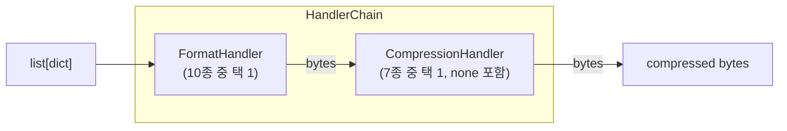
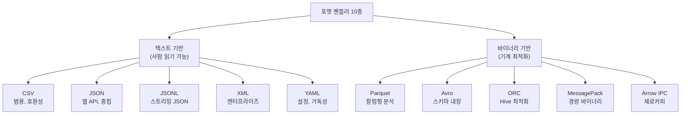
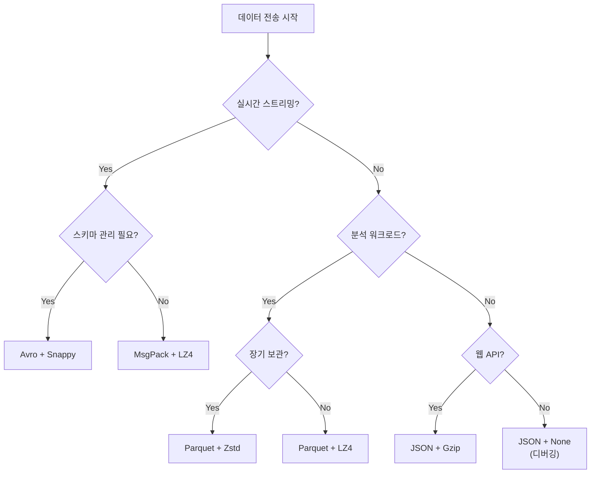

# 04. 핸들러 설계

> Interceptor 패턴 — 10종 포맷 × 7종 압축 = 70가지 조합을 11개 클래스로

---

## 목차

1. [인터셉터 패턴의 목적](#1-인터셉터-패턴의-목적)
2. [HandlerChain 합성 구조](#2-handlerchain-합성-구조)
3. [포맷 핸들러 10종](#3-포맷-핸들러-10종)
4. [압축 핸들러 6종](#4-압축-핸들러-6종)
5. [조합 전략](#5-조합-전략)
6. [라이브러리 선정 근거](#6-라이브러리-선정-근거)
7. [관련 문서](#7-관련-문서)

---

## 1. 인터셉터 패턴의 목적

### 1.1 왜 포맷과 압축을 분리하는가

**문제**: 파이프라인에서 데이터 직렬화(포맷)와 압축은 별개의 관심사다. 이를 결합하면 조합 폭발이 발생한다.

| 접근법 | 클래스 수 | 새 포맷 추가 비용 |
|--------|----------|-----------------|
| 포맷별 압축 내장 | 70개 (10 × 7) | 7개 클래스 작성 |
| 포맷+압축 상속 | ~20개 | 다이아몬드 상속 문제 |
| **Interceptor 합성** | **11개** | **1개 클래스** |

**핵심 원리**: 포맷 핸들러는 `dict ↔ bytes` 변환만, 압축 핸들러는 `bytes ↔ bytes` 변환만 담당한다. `HandlerChain`이 이 둘을 합성한다.

### 1.2 파이프라인 내 위치

```
Generator ──→ [list[dict]] ──→ HandlerChain ──→ [bytes] ──→ Adapter
                                    │
                              ┌─────┴─────┐
                              │           │
                         FormatHandler  CompressionHandler
                         dict → bytes   bytes → bytes
```

---

## 2. HandlerChain 합성 구조

### 2.1 구조



### 2.2 인터페이스

```python
class HandlerChain:
    """Format + Compression 합성"""

    def __init__(
        self,
        format_handler: BaseFormatHandler,
        compression_handler: BaseCompressionHandler | None = None,
    ):
        self._format = format_handler
        self._compression = compression_handler  # None = no compression

    async def encode(self, records: list[dict]) -> bytes:
        """list[dict] → 직렬화 → 압축 → bytes"""
        raw = await self._format.encode(records)
        if self._compression:
            return await self._compression.compress(raw)
        return raw

    async def decode(self, data: bytes) -> list[dict]:
        """bytes → 해제 → 역직렬화 → list[dict]"""
        if self._compression:
            data = await self._compression.decompress(data)
        return await self._format.decode(data)
```

### 2.3 ABC 정의

```python
class BaseFormatHandler(ABC):
    """포맷 핸들러 기본 인터페이스"""

    @property
    @abstractmethod
    def format_name(self) -> str: ...

    @property
    @abstractmethod
    def content_type(self) -> str: ...

    @property
    @abstractmethod
    def file_extension(self) -> str: ...

    @abstractmethod
    async def encode(self, records: list[dict]) -> bytes: ...

    @abstractmethod
    async def decode(self, data: bytes) -> list[dict]: ...


class BaseCompressionHandler(ABC):
    """압축 핸들러 기본 인터페이스"""

    @property
    @abstractmethod
    def algorithm_name(self) -> str: ...

    @property
    @abstractmethod
    def file_extension(self) -> str: ...

    @abstractmethod
    async def compress(self, data: bytes) -> bytes: ...

    @abstractmethod
    async def decompress(self, data: bytes) -> bytes: ...
```

### 2.4 cramjam 통합 압축 핸들러

기존 설계에서 6개의 개별 압축 핸들러 클래스(GzipHandler, BrotliHandler 등)를 사용했으나, `cramjam` 라이브러리 도입으로 **1개의 파라미터화된 클래스**로 통합한다. 이로써 핸들러 클래스 수가 16개 → 11개(포맷 10 + 압축 1)로 감소한다.

```python
import cramjam

class CramjamCompressionHandler(BaseCompressionHandler):
    """cramjam 기반 통합 압축 핸들러 — 6종 알고리즘을 단일 클래스로 처리"""

    ALGORITHMS = {
        "gzip": (cramjam.gzip.compress, cramjam.gzip.decompress),
        "brotli": (cramjam.brotli.compress, cramjam.brotli.decompress),
        "snappy": (cramjam.snappy.compress, cramjam.snappy.decompress),
        "lz4": (cramjam.lz4.compress, cramjam.lz4.decompress),
        "zstd": (cramjam.zstd.compress, cramjam.zstd.decompress),
        "lzma": (cramjam.lzma.compress, cramjam.lzma.decompress),
    }

    EXTENSIONS = {
        "gzip": ".gz", "brotli": ".br", "snappy": ".snappy",
        "lz4": ".lz4", "zstd": ".zst", "lzma": ".lzma",
    }

    def __init__(self, algorithm: str):
        if algorithm not in self.ALGORITHMS:
            raise ValueError(f"Unknown algorithm: {algorithm}")
        self._algorithm = algorithm
        self._compress, self._decompress = self.ALGORITHMS[algorithm]

    @property
    def algorithm_name(self) -> str:
        return self._algorithm

    @property
    def file_extension(self) -> str:
        return self.EXTENSIONS[self._algorithm]

    async def compress(self, data: bytes) -> bytes:
        return bytes(self._compress(data))

    async def decompress(self, data: bytes) -> bytes:
        return bytes(self._decompress(data))
```

**Registry 등록**: 6종 알고리즘을 for-loop로 일괄 등록한다.

```python
for algo in CramjamCompressionHandler.ALGORITHMS:
    compression_registry.register(algo)(
        lambda algo=algo: CramjamCompressionHandler(algo)
    )
```

**통합 효과**:
- 6개 클래스 → 1개 파라미터화 클래스 (코드량 ~70% 감소)
- 시스템 C 라이브러리 의존성 제거 (`brotli`, `python-snappy` 등 → Rust 기반 `cramjam`)
- 모든 알고리즘이 동일한 `bytes → bytes` 인터페이스 보장

---

## 3. 포맷 핸들러 10종

### 3.1 포맷 분류



### 3.2 각 포맷 상세

| 포맷 | 라이브러리 | Content-Type | 확장자 | 특성 |
|------|-----------|-------------|--------|------|
| **CSV** | stdlib `csv` | `text/csv` | `.csv` | 범용 호환, 사람 읽기 가능, 타입 정보 없음 |
| **JSON** | `orjson` | `application/json` | `.json` | 중첩 구조 지원, 웹 API 표준 |
| **JSONL** | `orjson` | `application/jsonl` | `.jsonl` | 줄 단위 JSON, 스트리밍 적합 |
| **Parquet** | `pyarrow` | `application/parquet` | `.parquet` | 컬럼형, 분석 최적화, 자체 압축 |
| **Avro** | `fastavro` | `application/avro` | `.avro` | 스키마 내장, Kafka 생태계 호환 |
| **ORC** | `pyarrow.orc` | `application/orc` | `.orc` | Hive 최적화, 높은 압축률 |
| **MessagePack** | `msgspec` | `application/msgpack` | `.msgpack` | 경량 바이너리 JSON, 빠른 직렬화 |
| **Arrow IPC** | `pyarrow` | `application/arrow` | `.arrow` | 제로카피 공유, 인메모리 분석 |
| **XML** | `lxml` | `application/xml` | `.xml` | 엔터프라이즈 통합, XSLT 변환 |
| **YAML** | `pyyaml` | `application/yaml` | `.yaml` | 사람 읽기 최적, 설정 파일 |

### 3.3 포맷별 적합한 사용 사례

| 포맷 | 최적 시나리오 | 비적합 시나리오 |
|------|-------------|---------------|
| **CSV** | 범용 교환, 스프레드시트 호환 | 중첩 데이터, 대규모 배치 |
| **JSON** | REST API 응답, 문서 저장 | 대용량 분석, 컬럼 연산 |
| **JSONL** | 로그 수집, Kafka 메시지 | 관계형 데이터, 조인 |
| **Parquet** | 분석 워크로드, 데이터 레이크 | 실시간 스트리밍, 소량 데이터 |
| **Avro** | Kafka 스키마 레지스트리, 스트리밍 | 사람이 읽어야 하는 경우 |
| **ORC** | Hive/Spark 분석, 집계 쿼리 | 범용 교환, 비 Hadoop 환경 |
| **MessagePack** | 경량 RPC, IoT 메시지 | 스키마 검증이 필요한 경우 |
| **Arrow IPC** | 프로세스 간 공유, 인메모리 분석 | 디스크 저장, 네트워크 전송 |
| **XML** | SOAP, 엔터프라이즈 통합, 레거시 | 성능 민감, 대용량 |
| **YAML** | 설정 교환, 소규모 데이터 | 대규모, 바이너리 데이터 |

---

## 4. 압축 핸들러 6종

### 4.1 압축률 vs 속도 트레이드오프

```
압축률 (높음) ◀──────────────────────────────▶ 속도 (빠름)

  LZMA     Brotli     Gzip/Zstd     LZ4     Snappy     None
  ────      ────       ────          ───      ────       ───
  70-85%    60-80%     50-70%        30-50%   20-40%     0%
  매우느림   느림        보통          빠름     매우빠름    -
```

### 4.2 각 압축 상세

| 알고리즘 | 라이브러리 | 확장자 | 압축률 | 속도 | 특성 |
|---------|-----------|--------|--------|------|------|
| **Gzip** | `cramjam.gzip` | `.gz` | 50-70% | 보통 | HTTP 표준, 범용 호환 |
| **Brotli** | `cramjam.brotli` | `.br` | 60-80% | 느림 | 최고 압축률, 웹 최적화 |
| **Snappy** | `cramjam.snappy` | `.snappy` | 20-40% | 매우 빠름 | Google 개발, Kafka 기본 |
| **LZ4** | `cramjam.lz4` | `.lz4` | 30-50% | 빠름 | Parquet 기본 압축 |
| **Zstandard** | `cramjam.zstd` | `.zst` | 50-70% | 보통~빠름 | Facebook 개발, Gzip 대체 |
| **LZMA** | `cramjam.lzma` | `.lzma` | 70-85% | 매우 느림 | 최고 압축률, 아카이브용 |

### 4.3 압축별 적합한 시나리오

| 시나리오 | 권장 압축 | 근거 |
|---------|----------|------|
| **실시간 Kafka 스트리밍** | Snappy | 지연시간 최소화, Kafka 네이티브 지원 |
| **대규모 배치 적재** | LZ4, Zstd | 빠른 압축+양호한 압축률 균형 |
| **S3 데이터 레이크** | Zstd, Gzip | 스토리지 비용 절감, 범용 호환 |
| **API 응답** | Gzip, Brotli | HTTP Content-Encoding 표준 |
| **콜드 스토리지 아카이브** | LZMA, Brotli | 최고 압축률, 읽기 빈도 낮음 |
| **IoT 센서 데이터** | Snappy, LZ4 | 빠른 처리, 대역폭 제한 환경 |
| **4000+ 컬럼 희소 데이터** | Zstd, Brotli | NULL 패턴 반복 → 높은 압축 효과 |

---

## 5. 조합 전략

### 5.1 70가지 조합 매트릭스

```
              None   Gzip   Brotli  Snappy  LZ4    Zstd   LZMA
CSV            ✅     ✅      ✅      ✅      ✅      ✅     ✅
JSON           ✅     ✅      ✅      ✅      ✅      ✅     ✅
JSONL          ✅     ✅      ✅      ✅      ✅      ✅     ✅
Parquet        ✅     ✅      ✅      ✅      ✅      ✅     ✅
Avro           ✅     ✅      ✅      ✅      ✅      ✅     ✅
ORC            ✅     ✅      ✅      ✅      ✅      ✅     ✅
MessagePack    ✅     ✅      ✅      ✅      ✅      ✅     ✅
Arrow          ✅     ✅      ✅      ✅      ✅      ✅     ✅
XML            ✅     ✅      ✅      ✅      ✅      ✅     ✅
YAML           ✅     ✅      ✅      ✅      ✅      ✅     ✅
```

모든 조합이 기술적으로 가능하다. HandlerChain은 Format → bytes → Compression 순서로 처리하므로, 포맷과 압축 간 의존성이 없다.

### 5.2 권장 조합

| 목적 | 포맷 + 압축 | 근거 |
|------|-----------|------|
| **Kafka 실시간 이벤트** | Avro + Snappy | Confluent 표준, 스키마 레지스트리 호환, 최소 지연 |
| **대규모 분석 배치** | Parquet + LZ4 | 컬럼형 최적화, Parquet 내장 압축 |
| **MongoDB 문서 적재** | JSON + Zstd | 중첩 구조 보존, 양호한 압축률 |
| **REST API 응답** | JSON + Gzip | HTTP 표준, 브라우저 호환 |
| **gRPC 대량 전송** | MessagePack + LZ4 | 경량 바이너리, 빠른 처리 |
| **S3 데이터 레이크** | Parquet + Zstd | 분석 도구 호환, 스토리지 최적화 |
| **IoT 센서 스트림** | MessagePack + Snappy | 경량 직렬화, 최소 오버헤드 |
| **콜드 아카이브** | Parquet + LZMA | 최대 압축률, 장기 보관 |
| **디버깅/개발** | JSON + None | 사람 읽기 가능, 압축 없음 |

### 5.3 주의할 조합

| 조합 | 주의사항 |
|------|---------|
| Parquet + Gzip | Parquet 자체 압축과 중복 → 효과 미미, 오버헤드만 증가 |
| XML + LZMA | 두 단계 모두 느림 → 실시간 부적합 |
| Arrow + 임의 압축 | Arrow IPC는 인메모리 공유용 → 압축이 제로카피 이점 상쇄 |
| YAML + Snappy | YAML 파싱이 느림 → 스트리밍에서 병목 |

### 5.4 포맷+압축 선택 가이드



---

## 6. 라이브러리 선정 근거

### 6.1 변경된 라이브러리

| 라이브러리 | 대체 대상 | 선정 근거 |
|-----------|----------|----------|
| **orjson** | stdlib `json` | Rust 코어 기반 6-10x 성능, `datetime`/`numpy` 네이티브 직렬화, `bytes` 반환으로 버퍼 카피 제거 |
| **cramjam** | `gzip`, `brotli`, `python-snappy`, `lz4`, `zstandard`, `lzma` (6개→1개) | Rust 바인딩으로 6종 압축 통합, 시스템 C 라이브러리 의존성 제거, MIT 라이선스, 일관된 `bytes → bytes` API |
| **msgspec** | `msgpack` | 5-10x MessagePack 성능, Struct 기반 제로카피 디코딩, Pydantic 호환 |

### 6.2 유지 결정

| 라이브러리 | 유지 근거 |
|-----------|----------|
| **pyarrow** | Parquet, ORC, Arrow IPC 3종을 단일 라이브러리로 처리, 업계 표준 |
| **fastavro** | Avro 포맷의 사실상 표준, Confluent 생태계 호환 |
| stdlib `csv` | 단순 CSV에 외부 의존성 불필요, 성능 충분 |
| **lxml** | XML 처리의 사실상 표준, XPath/XSLT 지원 |
| **pyyaml** | YAML 설정 파싱, PyYAML이 가장 널리 사용되는 선택 |

---

## 7. 관련 문서

| 문서 | 내용 |
|------|------|
| [01-시스템-아키텍처](./01-시스템-아키텍처.md) | Interceptor 패턴 선택 근거 |
| [02-데이터-흐름](./02-데이터-흐름.md) | HandlerChain의 파이프라인 내 위치 |
| [03-어댑터-설계](./03-어댑터-설계.md) | push(bytes)를 수신하는 어댑터 |
| [05-제너레이터-설계](./05-제너레이터-설계.md) | list[dict]를 생산하는 제너레이터 |
| [07-데이터셋-활용-방안](./07-데이터셋-활용-방안.md) | 데이터셋별 권장 포맷+압축 |
| [08-테스트-전략](./08-테스트-전략.md) | encode/decode roundtrip 검증 |
