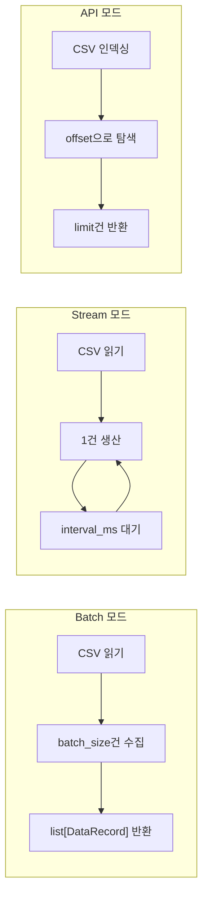

# 05. 제너레이터 설계

> 정적 CSV를 동적 데이터 소스로 변환하는 32종 시뮬레이터

---

## 목차

1. [제너레이터의 역할](#1-제너레이터의-역할)
2. [3가지 생성 모드](#2-3가지-생성-모드)
3. [카테고리별 제너레이터 설계](#3-카테고리별-제너레이터-설계)
4. [스키마 검증](#4-스키마-검증)
5. [공통 설정](#5-공통-설정)
6. [관련 문서](#6-관련-문서)

---

## 1. 제너레이터의 역할

### 1.1 왜 제너레이터가 필요한가

Kaggle 데이터셋은 **정적 CSV 파일**이다. 그러나 인프라 테스트에는 다양한 형태의 데이터 소스가 필요하다:

| 요구사항 | CSV 파일만으로 | 제너레이터 사용 시 |
|---------|-------------|----------------|
| 실시간 이벤트 시뮬레이션 | 불가능 | Stream 모드로 시간 간격 제어 |
| 대규모 배치 분할 | 수동 분할 필요 | batch_size 설정으로 자동 |
| API 페이지네이션 | 별도 구현 필요 | API 모드로 offset/limit 제공 |
| 스키마 검증 | 없음 | Pydantic v2로 자동 검증 |
| 셔플/재현성 | 별도 구현 | seed 설정으로 재현 가능 |
| 레코드 타임스탬프 | 없음 | DataRecord에 자동 부여 |

### 1.2 제너레이터 위치

```
CSV 파일 (Kaggle)
    │
    ▼
┌──────────────┐
│  Generator    │  ← 정적 CSV → 동적 DataRecord 변환
│  - 파일 읽기   │
│  - 스키마 검증  │
│  - 모드별 생산  │
└──────┬───────┘
       │ DataRecord
       ▼
  HandlerChain → Adapter
```

---

## 2. 3가지 생성 모드

### 2.1 BaseGenerator ABC

```python
class BaseGenerator(ABC):
    """모든 제너레이터의 기본 인터페이스"""

    def __init__(self, config: GeneratorConfig):
        self._config = config

    @abstractmethod
    async def batch(self) -> list[DataRecord]:
        """배치 모드: batch_size만큼 레코드 수집하여 반환"""

    @abstractmethod
    async def stream(self) -> AsyncIterator[DataRecord]:
        """스트림 모드: interval마다 1건씩 비동기 생산"""

    @abstractmethod
    async def fetch(self, offset: int, limit: int) -> list[DataRecord]:
        """API 모드: offset/limit 기반 페이지네이션"""
```

### 2.2 모드별 동작 비교



### 2.3 DataRecord 래퍼

모든 생성 모드는 원본 CSV 행을 `DataRecord`로 감싸서 반환한다:

```python
class DataRecord(BaseModel):
    """데이터 레코드 래퍼"""
    dataset: str           # "home_credit", "olist", ...
    index: int             # 레코드 순번
    timestamp: float       # 생성 시각 (time.time())
    payload: dict[str, Any]  # 원본 CSV 행 데이터
```

**래퍼를 사용하는 이유**:
- 데이터셋 식별: 여러 데이터셋을 혼합 처리할 때 출처 추적
- 순서 보장: index로 원본 순서 보존
- 시간 추적: timestamp로 생성 시점 기록 (스트리밍 지연 측정)
- 메타데이터 분리: payload는 원본 데이터만, 나머지는 프레임워크 메타

---

## 3. 카테고리별 제너레이터 설계

### 3.1 Category A: Relational (8종)

관계형 데이터의 **무결성 보존**과 **적재 순서 관리**에 집중한다.

#### HomeCreditGenerator (A1)

```
파일: data/home-credit-default-risk/
핵심: FK 관계 보존, 다중 테이블 모드, 금융 데이터 정밀도
```
- **FK 관계 보존**: `SK_ID_CURR` 기준으로 관련 테이블 레코드를 함께 생성
- **다중 테이블 모드**: 단일 테이블 또는 관련 테이블 묶음으로 생성 선택
- **금융 데이터 정밀도**: `AMT_*` 컬럼의 소수점 정밀도 보존

#### OlistGenerator (A2)

```
파일: data/brazilian-ecommerce/
핵심: 스타 스키마 — Dimension 선적재, Fact 후적재 순서 보장
```
- **적재 순서**: customers, products, sellers (Dimension) → orders, order_items (Fact)
- **UTF-8 다국어**: 포르투갈어 텍스트 무결성 보존
- **지리 데이터**: 위도·경도, ZIP 코드 타입 보존

#### HmGenerator (A3)

```
파일: data/h-and-m-personalized-fashion-recommendations/
핵심: 3천만 트랜잭션의 대규모 배치 처리
```
- **메모리 효율**: 3천만 건 청크 단위 읽기
- **날짜 파티셔닝**: `t_dat` 기반 날짜 범위 필터링
- **배치 크기 최적화**: 1K~100K 범위 탐색 지원

#### GaStoreGenerator (A4)

```
파일: data/google-analytics-sample/
핵심: JSON 컬럼 파싱, DW 패턴 시뮬레이션
```
- **JSON 컬럼 추출**: `totals`, `trafficSource`, `device` JSON 컬럼 → 구조화
- **세션 기반 그룹핑**: `fullVisitorId` + `visitId` 기반 세션 묶음 생성
- **BigQuery 호환**: SQL-over-HTTP 적재를 위한 플랫 레코드 변환

#### FraudTransGenerator (A5)

```
파일: data/fraudulent-transactions-prediction/
핵심: 금융원장 패턴, 트랜잭션 무결성
```
- **금융 정밀도**: 금액 필드 DECIMAL 보존
- **원장 패턴**: 차변/대변 쌍 무결성 검증
- **Oracle 호환**: Oracle 타입 매핑 (NUMBER, VARCHAR2)

#### ChinookGenerator (A6)

```
파일: data/chinook-sqlite/
핵심: 11테이블 ER, 경량 테스트
```
- **SQLite 원본 읽기**: SQLite DB 직접 쿼리로 레코드 생성
- **ER 관계 보존**: 11테이블 FK 순서 적재
- **CI 최적화**: 2MB로 빠른 테스트 사이클

#### EuroSoccerGenerator (A7)

```
파일: data/soccer/
핵심: SQLite → RDBMS 마이그레이션 패턴
```
- **SQLite 원본 읽기**: 7테이블 직접 쿼리
- **마이그레이션 시뮬레이션**: SQLite → PostgreSQL/CockroachDB 타입 변환
- **날짜 처리**: 다양한 날짜 포맷 정규화

#### NorthwindGenerator (A8)

```
파일: data/northwind-traders/
핵심: 14테이블 M:N 관계
```
- **M:N 관계**: 주문-제품 다대다 관계 보존
- **적재 순서 자동화**: 참조 관계 기반 토폴로지 정렬
- **멀티 RDBMS**: PostgreSQL, MySQL, MariaDB 타입 매핑

### 3.2 Category B: Document / Semi-Structured (6종)

**문서 구조 변환**과 **대량 비정규화**에 집중한다.

#### InstacartGenerator (B1)

```
파일: data/instacart-market-basket-analysis/
핵심: 관계형 CSV → 중첩 JSON 문서 변환
```
- **Denormalization**: orders + products + aisles + departments → 중첩 문서
- **가변 배열**: 주문당 상품 수 1~100+ 범위 → 문서 크기 가변
- **3단계 중첩**: `order.products[].aisle.department`

```python
# 변환 예시
{
    "order_id": 1,
    "user_id": 112108,
    "products": [
        {
            "product_name": "Bulgarian Yogurt",
            "aisle": "yogurt",
            "department": "dairy eggs",
            "add_to_cart_order": 1,
            "reordered": true
        }
    ]
}
```

#### TmdbGenerator (B2)

```
파일: data/tmdb-movie-metadata/
핵심: JSON 문자열 컬럼 → 실제 객체 파싱
```
- **JSON 컬럼 파싱**: `genres`, `cast`, `crew`, `keywords` 문자열 → 배열 객체
- **가변 길이**: cast 크기 0~수백 → 문서 크기 편차
- **소규모 정밀**: 5000건으로 빠른 변환 검증

#### AirbnbGenerator (B3)

```
파일: data/airbnb-seattle/
핵심: 리뷰 텍스트 + 지리 좌표 복합 문서
```
- **멀티 모달**: 텍스트 리뷰 + 숫자 평점 + GeoJSON 좌표
- **리뷰 중첩**: 숙소 문서 내 리뷰 배열 임베딩
- **Elasticsearch 매핑**: 텍스트 분석기 + geo_point 타입

#### AmazonReviewsGenerator (B4)

```
파일: data/amazonreviews/
핵심: 대량 리뷰 텍스트, 감성 라벨
```
- **대량 텍스트**: 3.5GB 리뷰 스트리밍 읽기
- **감성 라벨**: 긍정/부정 라벨 기반 토픽 분리
- **Elasticsearch 벌크**: 대량 인덱싱 최적화

#### YelpGenerator (B5)

```
파일: data/yelp-dataset/
핵심: 최대 규모 문서셋, 멀티 컬렉션
```
- **멀티 엔티티**: business, review, user, checkin, tip, photo 6종
- **대규모 처리**: 8.65GB 청크 읽기, 메모리 효율
- **사진 참조**: photo 엔티티 → S3 경로 매핑

#### FoodComGenerator (B6)

```
파일: data/food-com-recipes-and-user-interactions/
핵심: 가변 배열 (재료, 조리 단계)
```
- **재료 배열**: 레시피별 재료 목록 (가변 길이)
- **단계 배열**: 순서가 있는 조리 단계
- **사용자 인터랙션**: 레시피-사용자 별점 관계

### 3.3 Category C: Log / Event Stream (7종)

**시간 순서 보존**과 **실시간 시뮬레이션**에 집중한다.

#### StoreSalesGenerator (C1)

```
파일: data/demand-forecasting-kernels-only/
핵심: 일별 시계열, 정규 패턴 재생
```
- **시간 순서 보장**: `date` 컬럼 기준 오름차순 발행
- **시간 압축**: 5년(1826일) → 설정된 시간 내 재생
- **파티션 키**: `store_id`를 Kafka 파티션 키로 활용

#### IeeFraudGenerator (C2)

```
파일: data/ieee-fraud-detection/
핵심: 이벤트 로그, 정상/비정상 혼합 스트리밍
```
- **TransactionDT 순서**: 트랜잭션 시간 기반 순차 발행
- **Fraud 라벨링**: `isFraud`로 정상(96.5%)/비정상(3.5%) 구분
- **넓은 스키마**: 434열 이벤트의 효율적 직렬화 (NULL 처리)

#### TwitterSentimentGenerator (C3)

```
파일: data/twitter-entity-sentiment-analysis/
핵심: 텍스트 이벤트 스트림, 감성 라벨
```
- **텍스트 이벤트**: 트윗 텍스트 + 감성 라벨 이벤트화
- **NATS 발행**: JetStream subject 기반 라우팅
- **언어 필터링**: 다국어 텍스트 인코딩 보존

#### CcFraudGenerator (C4)

```
파일: data/creditcardfraud/
핵심: PCA 변환 데이터, 희소 라벨
```
- **PCA 피처**: V1~V28 수치 정밀도 보존
- **희소 이벤트**: 0.17% Fraud → 시뮬레이션 비율 조절 가능
- **Redis Streams**: 실시간 스코어링 이벤트 발행

#### ClickstreamGenerator (C5)

```
파일: data/ecommerce-behavior-data-from-multi-category-store/
핵심: 최대 규모 이벤트 스트림 (285M)
```
- **대규모 스트리밍**: 2.85억 이벤트 메모리 효율 읽기
- **이벤트 타입**: view, cart, purchase 이벤트 분류
- **멀티 파티션**: category_id 기반 Kafka 파티션 분배

#### NetworkTrafficGenerator (C6)

```
파일: data/labeled-network-traffic-flows-114-applications/
핵심: 네트워크 플로우 라벨링
```
- **플로우 레코드**: 소스/목적지 IP, 포트, 프로토콜 메타데이터
- **앱 분류**: 141개 애플리케이션 라벨 기반 토픽 분리
- **Pulsar 멀티토픽**: 앱 카테고리별 Pulsar 토픽 매핑

#### BitcoinGenerator (C7)

```
파일: data/bitcoin-historical-data/
핵심: 1분봉 OHLCV 금융 시계열
```
- **고빈도 발행**: 1분 간격 캔들스틱 데이터 순차 발행
- **OHLCV 정밀도**: Open/High/Low/Close/Volume 소수점 보존
- **NATS JetStream**: 금융 데이터 실시간 스트리밍

### 3.4 Category D: Time-Series / IoT (5종)

**센서 시뮬레이션**과 **IoT 프로토콜 발행**에 집중한다.

#### BoschGenerator (D1)

```
파일: data/bosch-production-line-performance/
핵심: 4000+ 피처, 고차원 IoT 시뮬레이션
```
- **고차원 처리**: 4000+ 열을 메모리 효율적으로 읽기 (청크 + 희소 표현)
- **NULL 전략**: 90%+ NULL → 비 NULL 값만 payload에 포함
- **센서 그룹핑**: 피처를 생산 스테이션별 그룹화 → MQTT 토픽 분리

#### WeatherGenerator (D2)

```
파일: data/weather-dataset/
핵심: 시계열 기상, MQTT → S3 파이프라인
```
- **기상 관측값**: 온도, 습도, 풍속 등 다중 센서값
- **MQTT 발행**: 센서 타입별 토픽 분리
- **S3 아카이빙**: MQTT 수신 → Parquet 변환 → S3 저장 시뮬레이션

#### ElectricPowerGenerator (D3)

```
파일: data/electric-power-consumption-data-set/
핵심: 1분 간격 연속 측정, 가정용 전력
```
- **1분 간격**: 200만 건 연속 측정 시뮬레이션
- **MQTT 발행**: 전력 계측기 IoT 시뮬레이션
- **결측치 처리**: 원본 결측 패턴 보존 또는 보간 옵션

#### AppliancesEnergyGenerator (D4)

```
파일: data/appliances-energy-prediction/
핵심: 다실 센서, 10분 간격
```
- **다중 센서**: 방별 온도/습도 센서 분리
- **RabbitMQ 라우팅**: 방별 큐 분배, 센서 타입 라우팅 키
- **에너지 예측 라벨**: Appliances 에너지 소비량 타겟

#### SmartMfgGenerator (D5)

```
파일: data/smart-manufacturing-iot-cloud-monitoring-dataset/
핵심: 50머신 센서, MQTT→Kafka 브릿지
```
- **50머신 시뮬레이션**: 머신별 센서 데이터 독립 생성
- **MQTT→Kafka 브릿지**: MQTT로 발행 → Kafka로 수집하는 패턴
- **이상 탐지 라벨**: 정상/이상 머신 상태 라벨

### 3.5 Category E: Text / Unstructured (3종)

**장문 텍스트 처리**와 **전문검색 인덱싱**에 집중한다.

#### StackOverflowGenerator (E1)

```
파일: data/stacksample/
핵심: Q&A 텍스트, TEXT/CLOB 처리
```
- **장문 텍스트**: 질문/답변 본문 TEXT 컬럼 처리
- **태그 시스템**: 다중 태그 → 배열 필드 변환
- **Cassandra 적재**: 파티션 키 = tag, 클러스터링 키 = score

#### EnronEmailGenerator (E2)

```
파일: data/enron-email-dataset/
핵심: 이메일 파싱, 헤더/본문 분리
```
- **이메일 파싱**: From/To/Subject 헤더 + 본문 분리
- **스레드 구조**: In-Reply-To 기반 대화 스레드 재구성
- **Elasticsearch 인덱싱**: 이메일 전문검색, 첨부 파일 메타데이터

#### GitHubMetadataGenerator (E3)

```
파일: data/github-repository-metadata-with-5-stars/
핵심: 300만 레포 메타데이터 JSON
```
- **대량 문서**: 300만 레포지토리 메타데이터 벌크 생성
- **중첩 구조**: topics 배열, languages 맵, owner 객체
- **MongoDB 벌크**: 대량 insert 최적화

### 3.6 Category F: Geospatial / Trajectory (3종)

**지리 좌표 변환**과 **궤적 데이터 처리**에 집중한다.

#### NycTaxiGenerator (F1)

```
파일: data/new-york-city-taxi-fare-prediction/
핵심: 5500만 건 대량 로그, 지리 좌표 변환
```
- **GeoJSON 변환**: `pickup_longitude/latitude` → GeoJSON Point
- **대량 스트리밍**: 5500만 건 메모리 제한 내 스트리밍
- **시간대 분포**: 시간대별 레코드 밀도 패턴 보존

#### GeoLifeGenerator (F2)

```
파일: data/microsoft-geolife-gps-trajectory-dataset/
핵심: GPS 궤적, 17K 파일, 시간순 경로
```
- **다수 파일 읽기**: 17,000개 파일 병합 읽기
- **궤적 구성**: 사용자별 시간순 GPS 포인트 → 궤적 문서
- **SFTP 시뮬레이션**: 파일 단위 SFTP 전송 후 적재

#### DataCoGenerator (F3)

```
파일: data/dataco-smart-supply-chain-for-big-data-analysis/
핵심: 공급망 배송 좌표, RDBMS+지리
```
- **배송 좌표**: 출발지/도착지 위도·경도 쌍
- **PostgreSQL 지리**: PostGIS 호환 지리 컬럼 생성
- **공급망 스키마**: 주문-배송-고객 관계형 모델

---

## 4. 스키마 검증

### 4.1 Pydantic v2 기반 검증

각 데이터셋은 Pydantic v2 모델로 스키마를 정의한다. Generator가 CSV 행을 DataRecord로 변환할 때 스키마를 검증한다.

```python
# schemas/datasets/home_credit.py
class HomeCreditApplication(BaseModel):
    sk_id_curr: int = Field(..., description="Client ID")
    target: int | None = Field(None, ge=0, le=1)
    name_contract_type: str
    code_gender: str
    flag_own_car: str
    flag_own_realty: str
    cnt_children: int = Field(ge=0)
    amt_income_total: float = Field(ge=0)
    amt_credit: float = Field(ge=0)
    amt_annuity: float | None = None
    amt_goods_price: float | None = None
    # 120+ 컬럼 계속...

# schemas/datasets/bitcoin.py (신규)
class BitcoinOHLCV(BaseModel):
    timestamp: int
    open: float = Field(ge=0)
    high: float = Field(ge=0)
    low: float = Field(ge=0)
    close: float = Field(ge=0)
    volume_btc: float = Field(ge=0)
    volume_currency: float = Field(ge=0)

# schemas/datasets/yelp.py (신규)
class YelpBusiness(BaseModel):
    business_id: str
    name: str
    city: str
    state: str
    latitude: float = Field(ge=-90, le=90)
    longitude: float = Field(ge=-180, le=180)
    stars: float = Field(ge=1, le=5)
    review_count: int = Field(ge=0)
    categories: list[str] | None = None
```

### 4.2 검증 전략

| 검증 수준 | 적용 시점 | 성능 영향 |
|----------|---------|----------|
| **Strict** | 개발/테스트 | 모든 레코드 Pydantic 검증 (느림) |
| **Sample** | 배치 모드 | 배치의 첫 N건만 검증 (균형) |
| **Skip** | 성능 테스트 | 검증 생략 (최대 처리량) |

```python
class GeneratorConfig(BaseModel):
    # ...
    validation_mode: Literal["strict", "sample", "skip"] = "sample"
    sample_size: int = Field(default=10, ge=1)  # sample 모드 시 검증 건수
```

### 4.3 검증 실패 시 동작

```
검증 실패 → ValidationError
  → strict 모드: 즉시 중단, 에러 컨텍스트 보존
  → sample 모드: 경고 로깅, 실패 레코드 건너뛰기
  → skip 모드: 검증 안 함 (파싱 에러만 잡음)
```

---

## 5. 공통 설정

### 5.1 GeneratorConfig

```python
class GeneratorConfig(BaseModel):
    """제너레이터 공통 설정"""
    dataset_name: str                                    # 데이터셋 식별자
    data_path: Path                                      # CSV 파일 경로
    mode: GeneratorMode = GeneratorMode.BATCH            # STREAM | BATCH | API
    batch_size: int = Field(default=1000, ge=1, le=1_000_000)
    stream_interval_ms: int = Field(default=100, ge=1)   # Stream 모드 간격
    max_records: int | None = None                       # 최대 생성 건수
    shuffle: bool = True                                 # 순서 무작위화
    seed: int | None = None                              # 재현 가능한 시드
    validation_mode: Literal["strict", "sample", "skip"] = "sample"
```

### 5.2 GeneratorMode Enum

```python
class GeneratorMode(str, Enum):
    STREAM = "stream"     # AsyncIterator, 실시간 시뮬레이션
    BATCH = "batch"       # list[DataRecord], 대량 적재
    API = "api"           # offset/limit, 페이지네이션
```

### 5.3 YAML 설정 예시

```yaml
# configs/generators/ieee_fraud.yaml
dataset_name: "ieee_fraud"
data_path: "./data/ieee-fraud-detection/"
mode: "stream"
stream_interval_ms: 50
max_records: 100000
shuffle: false            # 시간 순서 보존
validation_mode: "sample"
```

### 5.4 32종 제너레이터 요약

| ID | 제너레이터 | 카테고리 | 주요 모드 | 핵심 특성 |
|----|----------|---------|----------|----------|
| A1 | HomeCreditGenerator | Relational | Batch | FK 관계, 122열 |
| A2 | OlistGenerator | Relational | Batch | 스타 스키마, UTF-8 |
| A3 | HmGenerator | Relational | Batch | 3천만 건 벌크 |
| A4 | GaStoreGenerator | Relational | Batch | JSON 컬럼, DW |
| A5 | FraudTransGenerator | Relational | Batch | 금융원장 |
| A6 | ChinookGenerator | Relational | Batch, API | 11테이블 ER |
| A7 | EuroSoccerGenerator | Relational | Batch | SQLite 마이그레이션 |
| A8 | NorthwindGenerator | Relational | Batch | M:N 관계 |
| B1 | InstacartGenerator | Document | Batch, API | 중첩 문서 |
| B2 | TmdbGenerator | Document | Batch, API | JSON 파싱 |
| B3 | AirbnbGenerator | Document | Batch | 리뷰+지리 |
| B4 | AmazonReviewsGenerator | Document | Batch, Stream | 감성분석 |
| B5 | YelpGenerator | Document | Batch | 8.65GB 대규모 |
| B6 | FoodComGenerator | Document | Batch, API | 가변 배열 |
| C1 | StoreSalesGenerator | Event | Stream | 시계열 재생 |
| C2 | IeeFraudGenerator | Event | Stream | 434열 이벤트 |
| C3 | TwitterSentimentGenerator | Event | Stream | 텍스트 스트림 |
| C4 | CcFraudGenerator | Event | Stream | PCA, 희소 |
| C5 | ClickstreamGenerator | Event | Stream | 285M 이벤트 |
| C6 | NetworkTrafficGenerator | Event | Stream | 네트워크 플로우 |
| C7 | BitcoinGenerator | Event | Stream | 1분봉 OHLCV |
| D1 | BoschGenerator | IoT | Stream | 4000+ 피처 |
| D2 | WeatherGenerator | IoT | Stream | 기상 센서 |
| D3 | ElectricPowerGenerator | IoT | Stream | 1분 간격 전력 |
| D4 | AppliancesEnergyGenerator | IoT | Stream | 다실 센서 |
| D5 | SmartMfgGenerator | IoT | Stream | 50머신 브릿지 |
| E1 | StackOverflowGenerator | Text | Batch | Q&A TEXT |
| E2 | EnronEmailGenerator | Text | Batch | 이메일 파싱 |
| E3 | GitHubMetadataGenerator | Text | Batch | 300만 레포 |
| F1 | NycTaxiGenerator | Geospatial | Batch, Stream | GeoJSON, 5500만 |
| F2 | GeoLifeGenerator | Geospatial | Batch | GPS 궤적, 17K 파일 |
| F3 | DataCoGenerator | Geospatial | Batch | 공급망 좌표 |

---

## 6. 관련 문서

| 문서 | 내용 |
|------|------|
| [02-데이터-흐름](./02-데이터-흐름.md) | 제너레이터의 파이프라인 내 위치와 3가지 모드 흐름 |
| [04-핸들러-설계](./04-핸들러-설계.md) | DataRecord → HandlerChain 변환 과정 |
| [07-데이터셋-활용-방안](./07-데이터셋-활용-방안.md) | 32종 데이터셋의 특성과 활용 전략 |
| [08-테스트-전략](./08-테스트-전략.md) | 제너레이터 단위 테스트 전략 |
