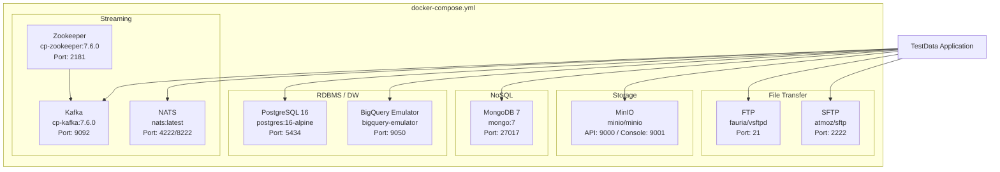
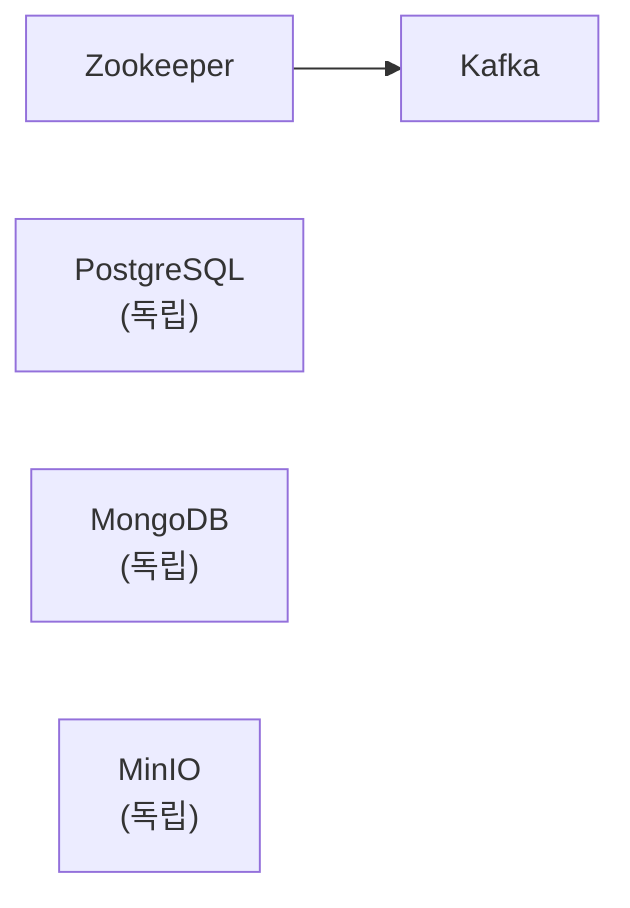

# 06. 인프라 구성

> Docker Compose 기반 로컬 인프라 — 격리된 테스트 환경

---

## 목차

1. [왜 Docker Compose인가](#1-왜-docker-compose인가)
2. [서비스 토폴로지](#2-서비스-토폴로지)
3. [네트워크와 포트 전략](#3-네트워크와-포트-전략)
4. [데이터 영속성](#4-데이터-영속성)
5. [헬스체크와 서비스 의존성](#5-헬스체크와-서비스-의존성)
6. [관련 문서](#6-관련-문서)

---

## 1. 왜 Docker Compose인가

### 1.1 결정 근거

| 대안 | 장점 | 단점 | 선택 여부 |
|------|------|------|----------|
| 로컬 설치 | 성능 최적 | OS별 차이, 충돌 위험 | ❌ |
| **Docker Compose** | **격리, 재현성, 원커맨드 실행** | **리소스 오버헤드** | **✅** |
| Kubernetes | 프로덕션 유사 | 설정 복잡, 로컬 리소스 과다 | ❌ |
| Testcontainers | 테스트 코드 내 관리 | 테스트 외 사용 불편 | ✅ (통합 테스트 보조 도구) |

**선택 이유**:
1. `docker compose up -d` 한 줄로 전체 인프라 시작
2. 부모 Demiurge 플랫폼과 동시 실행 가능 (포트 격리)
3. CI 환경에서도 동일하게 재현
4. 팀원 간 환경 차이 제거

### 1.2 범위

**Docker Compose로 관리하는 서비스** (Phase 3에서 필수인 핵심 4종 + Phase 5 확장 4종):
- PostgreSQL — RDBMS 대표
- MongoDB — NoSQL 대표
- Kafka + Zookeeper — Streaming 대표
- MinIO — Storage 대표
- **NATS** — Streaming (부모 Demiurge 플랫폼 호환)
- **BigQuery 에뮬레이터** — DW 어댑터 검증
- **FTP** — 레거시 파일 전송 검증
- **SFTP** — 보안 파일 전송 검증

**Docker Compose에 포함하지 않는 서비스** (Phase 5에서 필요 시 추가):
- MySQL, MariaDB, MSSQL, Oracle — RDBMS 확장
- Elasticsearch, Redis, Cassandra — NoSQL 확장
- RabbitMQ, MQTT, Pulsar — Streaming 확장

---

## 2. 서비스 토폴로지

### 2.1 서비스 구성도



### 2.2 서비스 상세

| 서비스 | 이미지 | 역할 |
|--------|--------|------|
| **PostgreSQL** | `postgres:16-alpine` | RDBMS 어댑터 테스트 (핵심) |
| **MongoDB** | `mongo:7` | NoSQL 어댑터 테스트, 문서 적재 |
| **Zookeeper** | `confluentinc/cp-zookeeper:7.6.0` | Kafka 메타데이터 관리 |
| **Kafka** | `confluentinc/cp-kafka:7.6.0` | Streaming 어댑터 테스트, 이벤트 발행 |
| **MinIO** | `minio/minio` | S3 호환 Storage 테스트 |
| **NATS** | `nats:latest` | JetStream 스트리밍, 부모 Demiurge 호환 |
| **BigQuery Emulator** | `ghcr.io/goccy/bigquery-emulator` | DW 어댑터 테스트, SQL-over-HTTP |
| **FTP** | `fauria/vsftpd` | 레거시 파일 전송 테스트 |
| **SFTP** | `atmoz/sftp` | 보안 파일 전송 테스트 |

---

## 3. 네트워크와 포트 전략

### 3.1 포트 충돌 방지

Demiurge 플랫폼(부모 프로젝트)과 TestData 프로젝트가 **동시 실행**될 수 있어야 한다.

| 서비스 | 부모 프로젝트 포트 | TestData 포트 | 환경 변수 |
|--------|-----------------|--------------|----------|
| PostgreSQL | 5433 (TimescaleDB) | **5434** | `PG_PORT` |
| MongoDB | - | 27017 | `MONGO_PORT` |
| Kafka | - | 9092 | `KAFKA_PORT` |
| MinIO | 9000/9001 | **9000/9001** | `MINIO_API_PORT` / `MINIO_CONSOLE_PORT` |
| NATS | 4222 (부모 NATS) | **4223/8223** | `NATS_PORT` / `NATS_MONITOR_PORT` |
| BigQuery Emulator | - | 9050 | `BQ_PORT` |
| FTP | - | 21 | `FTP_PORT` |
| SFTP | - | 2222 | `SFTP_PORT` |

**포트 충돌 방지 전략**:
- PostgreSQL: 부모 5433, TestData 5434
- NATS: 부모 4222, TestData 4223 (포트 충돌 방지)

### 3.2 환경 변수 기반 포트 설정

```yaml
# .env (기본값)
PG_PORT=5434
MONGO_PORT=27017
KAFKA_PORT=9092
MINIO_API_PORT=9000
MINIO_CONSOLE_PORT=9001
NATS_PORT=4223
NATS_MONITOR_PORT=8223
BQ_PORT=9050
FTP_PORT=21
FTP_PASV_MIN=30000
FTP_PASV_MAX=30009
SFTP_PORT=2222
```

포트 충돌 시 `.env`만 수정하면 된다.

### 3.3 네트워크 구성

```yaml
networks:
  testdata-network:
    driver: bridge
    name: demiurge-testdata-net
```

모든 서비스는 `testdata-network`에 연결된다. 부모 프로젝트의 네트워크(`demiurge-net`)와 격리된다.

---

## 4. 데이터 영속성

### 4.1 Named Volume 전략

| 볼륨 | 서비스 | 마운트 경로 |
|------|--------|-----------|
| `postgres_data` | PostgreSQL | `/var/lib/postgresql/data` |
| `mongo_data` | MongoDB | `/data/db` |
| `zk_data` | Zookeeper | `/var/lib/zookeeper/data` |
| `kafka_data` | Kafka | `/var/lib/kafka/data` |
| `minio_data` | MinIO | `/data` |
| `nats_data` | NATS | `/data/jetstream` |
| `ftp_data` | FTP | `/home/vsftpd` |
| `sftp_data` | SFTP | `/home/testdata/upload` |

### 4.2 초기화/리셋 전략

```bash
# 전체 리셋 (데이터 포함)
docker compose down -v

# 서비스만 재시작 (데이터 보존)
docker compose restart

# 특정 서비스 리셋
docker compose rm -s -v postgres
docker compose up -d postgres
```

### 4.3 데이터 초기화 스크립트

PostgreSQL 초기화 SQL을 `/docker-entrypoint-initdb.d/`에 마운트:

```yaml
postgres:
  volumes:
    - postgres_data:/var/lib/postgresql/data
    - ./scripts/init-postgres.sql:/docker-entrypoint-initdb.d/01-init.sql:ro
```

---

## 5. 헬스체크와 서비스 의존성

### 5.1 서비스별 헬스체크

| 서비스 | 헬스체크 방법 | 간격 | 재시도 |
|--------|-------------|------|--------|
| **PostgreSQL** | `pg_isready -U testdata` | 5s | 5회 |
| **MongoDB** | `mongosh --eval "db.adminCommand('ping')"` | 5s | 5회 |
| **Zookeeper** | `echo ruok \| nc localhost 2181` | 5s | 5회 |
| **Kafka** | `kafka-topics --bootstrap-server localhost:9092 --list` | 10s | 5회 |
| **MinIO** | `mc ready local` 또는 HTTP `/minio/health/ready` | 5s | 5회 |
| **NATS** | HTTP `GET /healthz` (monitoring port) | 5s | 5회 |
| **BigQuery Emulator** | HTTP `GET /` (port 9050) | 5s | 5회 |
| **FTP** | `nc -z localhost 21` | 5s | 5회 |
| **SFTP** | `nc -z localhost 22` | 5s | 5회 |

### 5.2 의존성 순서



- Kafka는 Zookeeper가 healthy 상태여야 시작
- PostgreSQL, MongoDB, MinIO는 독립적으로 시작 (의존성 없음)

### 5.3 Docker Compose 구성 요약

```yaml
services:
  postgres:
    image: postgres:16-alpine
    ports: ["${PG_PORT:-5434}:5432"]
    environment:
      POSTGRES_USER: testdata
      POSTGRES_PASSWORD: testdata_dev
      POSTGRES_DB: testdata
    volumes: [postgres_data:/var/lib/postgresql/data]
    healthcheck:
      test: ["CMD-SHELL", "pg_isready -U testdata"]
      interval: 5s
      retries: 5

  mongodb:
    image: mongo:7
    ports: ["${MONGO_PORT:-27017}:27017"]
    environment:
      MONGO_INITDB_ROOT_USERNAME: testdata
      MONGO_INITDB_ROOT_PASSWORD: testdata_dev
    volumes: [mongo_data:/data/db]
    healthcheck:
      test: ["CMD", "mongosh", "--eval", "db.adminCommand('ping')"]
      interval: 5s
      retries: 5

  zookeeper:
    image: confluentinc/cp-zookeeper:7.6.0
    ports: ["2181:2181"]
    environment:
      ZOOKEEPER_CLIENT_PORT: 2181
    volumes: [zk_data:/var/lib/zookeeper/data]
    healthcheck:
      test: ["CMD-SHELL", "echo ruok | nc localhost 2181"]
      interval: 5s
      retries: 5

  kafka:
    image: confluentinc/cp-kafka:7.6.0
    ports: ["${KAFKA_PORT:-9092}:9092"]
    depends_on:
      zookeeper:
        condition: service_healthy
    environment:
      KAFKA_BROKER_ID: 1
      KAFKA_ZOOKEEPER_CONNECT: zookeeper:2181
      KAFKA_ADVERTISED_LISTENERS: PLAINTEXT://localhost:9092,PLAINTEXT_INTERNAL://kafka:29092
      KAFKA_LISTENER_SECURITY_PROTOCOL_MAP: PLAINTEXT:PLAINTEXT,PLAINTEXT_INTERNAL:PLAINTEXT
      KAFKA_OFFSETS_TOPIC_REPLICATION_FACTOR: 1
      KAFKA_AUTO_CREATE_TOPICS_ENABLE: "true"
    volumes: [kafka_data:/var/lib/kafka/data]

  minio:
    image: minio/minio
    command: server /data --console-address ":9001"
    ports:
      - "${MINIO_API_PORT:-9000}:9000"
      - "${MINIO_CONSOLE_PORT:-9001}:9001"
    environment:
      MINIO_ROOT_USER: testdata
      MINIO_ROOT_PASSWORD: testdata_dev_password
    volumes: [minio_data:/data]
    healthcheck:
      test: ["CMD", "mc", "ready", "local"]
      interval: 5s
      retries: 5

  # --- 신규 서비스 4종 ---

  nats:
    image: nats:latest
    command: ["--jetstream", "--store_dir=/data/jetstream", "-m", "8222"]
    ports:
      - "${NATS_PORT:-4223}:4222"
      - "${NATS_MONITOR_PORT:-8223}:8222"
    volumes: [nats_data:/data/jetstream]
    healthcheck:
      test: ["CMD-SHELL", "wget -q --spider http://localhost:8222/healthz || exit 1"]
      interval: 5s
      retries: 5

  bigquery-emulator:
    image: ghcr.io/goccy/bigquery-emulator:latest
    command: ["--project=test-project", "--dataset=testdata"]
    ports:
      - "${BQ_PORT:-9050}:9050"
    healthcheck:
      test: ["CMD-SHELL", "wget -q --spider http://localhost:9050/ || exit 1"]
      interval: 5s
      retries: 5

  ftp:
    image: fauria/vsftpd
    ports:
      - "${FTP_PORT:-21}:21"
      - "${FTP_PASV_MIN:-30000}-${FTP_PASV_MAX:-30009}:30000-30009"
    environment:
      FTP_USER: testdata
      FTP_PASS: testdata_dev
      PASV_MIN_PORT: 30000
      PASV_MAX_PORT: 30009
    volumes: [ftp_data:/home/vsftpd]
    healthcheck:
      test: ["CMD-SHELL", "nc -z localhost 21 || exit 1"]
      interval: 5s
      retries: 5

  sftp:
    image: atmoz/sftp
    command: testdata:testdata_dev:::upload
    ports:
      - "${SFTP_PORT:-2222}:22"
    volumes: [sftp_data:/home/testdata/upload]
    healthcheck:
      test: ["CMD-SHELL", "nc -z localhost 22 || exit 1"]
      interval: 5s
      retries: 5

volumes:
  postgres_data:
  mongo_data:
  zk_data:
  kafka_data:
  minio_data:
  nats_data:
  ftp_data:
  sftp_data:

networks:
  default:
    name: demiurge-testdata-net
```

### 5.4 자격증명 요약

| 서비스 | 사용자 | 비밀번호 | 데이터베이스/버킷 |
|--------|--------|---------|----------------|
| PostgreSQL | `testdata` | `testdata_dev` | `testdata` |
| MongoDB | `testdata` | `testdata_dev` | (동적 생성) |
| Kafka | (인증 없음) | PLAINTEXT | (토픽 자동 생성) |
| MinIO | `testdata` | `testdata_dev_password` | (동적 생성) |
| NATS | (인증 없음) | — | JetStream 자동 활성화 |
| BigQuery Emulator | — | — | `test-project` / `testdata` |
| FTP | `testdata` | `testdata_dev` | `/home/vsftpd/testdata` |
| SFTP | `testdata` | `testdata_dev` | `/home/testdata/upload` |

> **보안 참고**: 이 자격증명은 로컬 개발/테스트 전용이다. 프로덕션 환경에서는 사용하지 않는다.

---

## 6. 관련 문서

| 문서 | 내용 |
|------|------|
| [00-프로젝트-개요](./00-프로젝트-개요.md) | 프로젝트 범위와 제약사항 |
| [03-어댑터-설계](./03-어댑터-설계.md) | 인프라에 연결하는 어댑터 설계 |
| [08-테스트-전략](./08-테스트-전략.md) | Docker 인프라를 활용한 통합 테스트 |
| [09-구현-로드맵](./09-구현-로드맵.md) | Phase 3에서 Docker Compose 구성 |
