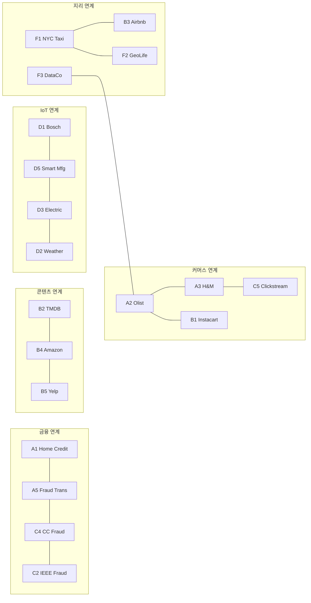

# 07. 데이터셋 활용 방안

> 32종 Kaggle 데이터셋 — 6카테고리 분류, 인프라 시나리오 검증, 데이터셋 간 연계 관계

---

## 목차

1. [데이터셋 선정 기준](#1-데이터셋-선정-기준)
2. [6카테고리 분류 체계](#2-6카테고리-분류-체계)
3. [Category A: Relational (8종)](#3-category-a-relational-8종)
4. [Category B: Document / Semi-Structured (6종)](#4-category-b-document--semi-structured-6종)
5. [Category C: Log / Event Stream (7종)](#5-category-c-log--event-stream-7종)
6. [Category D: Time-Series / IoT (5종)](#6-category-d-time-series--iot-5종)
7. [Category E: Text / Unstructured (3종)](#7-category-e-text--unstructured-3종)
8. [Category F: Geospatial / Trajectory (3종)](#8-category-f-geospatial--trajectory-3종)
9. [데이터셋 간 연계 관계](#9-데이터셋-간-연계-관계)
10. [데이터셋-인프라 매핑 매트릭스](#10-데이터셋-인프라-매핑-매트릭스)
11. [관련 문서](#11-관련-문서)

---

## 1. 데이터셋 선정 기준

### 1.1 왜 32종인가

기존 9종(RDBMS 3 + NoSQL 3 + Streaming 3) 구성은 카테고리별 대표성만 확보했다. 실무 복잡성을 반영하려면 다음이 필요하다:

| 확장 근거 | 기존 (9종) | 확장 후 (32종) |
|----------|-----------|--------------|
| 어댑터별 최소 2+ 데이터셋 매핑 | 일부 어댑터 미검증 | 22종 어댑터 모두 2+ 매핑 |
| 데이터 형태 다양성 | 관계형/문서/이벤트 | +시계열/텍스트/지리공간 |
| 크기 분포 | 6MB~13.5GB | 2MB~8.65GB 5단계 분포 |
| 도메인 간 연계 테스트 | 단일 데이터셋 검증 | 4종 연계 관계 (공유차원, 지리, 시간, 파이프라인) |
| 신규 어댑터 검증 | 18종 | 22종 (BigQuery, NATS, FTP, SFTP 추가) |

### 1.2 크기 Tier 분류

| Tier | 크기 범위 | 데이터셋 예시 | 용도 |
|------|----------|-------------|------|
| **Micro** | < 10MB | A6 Chinook (2MB), A8 Northwind (5MB), B2 TMDB (6MB) | 빠른 반복, 스키마 검증 |
| **Small** | 10~200MB | D4 Appliances (30MB), C1 Store Sales (35MB), A2 Olist (45MB) | 단위 테스트, 개발 |
| **Medium** | 200MB~2GB | C2 IEEE Fraud (1.4GB), B1 Instacart (1.3GB), B6 Food.com (1GB) | 통합 테스트 |
| **Large** | 2~5GB | A1 Home Credit (2.7GB), A3 H&M (3.5GB), E1 Stack Overflow (3.5GB) | 스트레스 테스트 |
| **XL** | 5GB+ | F1 NYC Taxi (5.3GB), B5 Yelp (8.65GB), D1 Bosch (13.5GB) | 한계 테스트 |

---

## 2. 6카테고리 분류 체계

기존 RDBMS/NoSQL/Streaming 3그룹 분류를 데이터의 **본질적 형태**에 따라 6카테고리로 재편한다.

```mermaid
graph TD
    DS["32종 데이터셋"]

    DS --> A["Category A: Relational<br/>8종 — 정규화된 관계형 데이터"]
    DS --> B["Category B: Document<br/>6종 — 중첩/반정형 문서"]
    DS --> C["Category C: Log/Event<br/>7종 — 이벤트 스트림"]
    DS --> D["Category D: Time-Series/IoT<br/>5종 — 센서/시계열"]
    DS --> E["Category E: Text<br/>3종 — 비정형 텍스트"]
    DS --> F["Category F: Geospatial<br/>3종 — 좌표/궤적"]

    A --> A1["A1 Home Credit"]
    A --> A2["A2 Olist"]
    A --> A3["A3 H&M"]
    A --> A4["A4 GA Store"]
    A --> A5["A5 Fraud Transactions"]
    A --> A6["A6 Chinook"]
    A --> A7["A7 Euro Soccer"]
    A --> A8["A8 Northwind"]

    B --> B1["B1 Instacart"]
    B --> B2["B2 TMDB"]
    B --> B3["B3 Airbnb"]
    B --> B4["B4 Amazon Reviews"]
    B --> B5["B5 Yelp"]
    B --> B6["B6 Food.com"]

    C --> C1["C1 Store Sales"]
    C --> C2["C2 IEEE Fraud"]
    C --> C3["C3 Twitter Sentiment"]
    C --> C4["C4 CC Fraud"]
    C --> C5["C5 Clickstream"]
    C --> C6["C6 Network Traffic"]
    C --> C7["C7 Bitcoin"]

    D --> D1["D1 Bosch"]
    D --> D2["D2 Weather"]
    D --> D3["D3 Electric Power"]
    D --> D4["D4 Appliances Energy"]
    D --> D5["D5 Smart Manufacturing"]

    E --> E1["E1 Stack Overflow"]
    E --> E2["E2 Enron Email"]
    E --> E3["E3 GitHub Metadata"]

    F --> F1["F1 NYC Taxi"]
    F --> F2["F2 GeoLife GPS"]
    F --> F3["F3 DataCo Supply Chain"]
```



### 분류 원칙

| 카테고리 | 데이터 본질 | 주요 검증 대상 | 종수 |
|---------|-----------|-------------|------|
| **A: Relational** | 정규화된 테이블, FK 관계 | RDBMS 적재, 조인, 스키마 무결성 | 8 |
| **B: Document** | 중첩 JSON, 가변 구조 | NoSQL 적재, 문서 변환, 검색 | 6 |
| **C: Log/Event** | 시간순 이벤트 로그 | 스트리밍 발행, 순서 보장, 처리량 | 7 |
| **D: Time-Series/IoT** | 센서값, 주기적 측정 | MQTT 발행, IoT 브릿지, 집계 | 5 |
| **E: Text** | 장문 텍스트, 비정형 | 전문검색, TEXT/CLOB 처리 | 3 |
| **F: Geospatial** | 좌표, 궤적, 경로 | 지리 인덱스, Geo-join, 궤적 저장 | 3 |

---

## 3. Category A: Relational (8종)

### A1. Home Credit Default Risk

**Kaggle**: `kaggle.com/c/home-credit-default-risk`

| 항목 | 값 |
|------|-----|
| 크기 | 2.7GB, 7테이블 122열 |
| 핵심 특징 | 다중 테이블 FK 관계, 금융 데이터 정밀도 |
| 주 어댑터 | PostgreSQL |
| 부 어댑터 | CockroachDB, MySQL |
| 포맷 | Parquet, Avro |
| 압축 | LZ4, Zstd |

**스키마 구조**:
```
application_train ──┬── bureau ── bureau_balance
(SK_ID_CURR)        │
                    ├── previous_application ── installments_payments
                    │                        ── POS_CASH_balance
                    │                        ── credit_card_balance
                    └── (7개 테이블 조인)
```

**검증 시나리오**: 복합 FK 보존, 다중 테이블 동시 적재, 120+ 컬럼 DDL 생성, DECIMAL 정밀도

### A2. Brazilian E-Commerce (Olist)

**Kaggle**: `kaggle.com/datasets/olistbr/brazilian-ecommerce`

| 항목 | 값 |
|------|-----|
| 크기 | 45MB, 9테이블 스타스키마 |
| 핵심 특징 | Fact + Dimension 구조, 다국어(포르투갈어), 지리 데이터 |
| 주 어댑터 | MySQL |
| 부 어댑터 | MariaDB, MSSQL |
| 포맷 | CSV, JSON |
| 압축 | Gzip |

**검증 시나리오**: 스타 스키마 적재 순서, UTF-8 다국어, 소규모 빠른 반복

### A3. H&M Fashion Recommendations

**Kaggle**: `kaggle.com/c/h-and-m-personalized-fashion-recommendations`

| 항목 | 값 |
|------|-----|
| 크기 | 3.5GB, 3천만 트랜잭션 |
| 핵심 특징 | 대규모 배치 처리, 날짜 파티셔닝 |
| 주 어댑터 | MSSQL |
| 부 어댑터 | PostgreSQL, Oracle |
| 포맷 | Parquet, Arrow |
| 압축 | LZ4, Zstd |

**검증 시나리오**: 3천만 건 벌크 INSERT, 배치 크기별 메모리 사용량, 인덱스 빌드

### A4. Google Analytics Store

**Kaggle**: `kaggle.com/c/google-analytics-sample`

| 항목 | 값 |
|------|-----|
| 크기 | 1.5GB, JSON 컬럼 |
| 핵심 특징 | DW 패턴, SQL-over-HTTP, JSON 내장 컬럼 |
| 주 어댑터 | **BigQuery** (신규) |
| 부 어댑터 | PostgreSQL |
| 포맷 | JSON, Parquet |
| 압축 | Gzip, Zstd |

**검증 시나리오**: BigQuery 에뮬레이터 DW 적재, JSON 컬럼 SQL 쿼리, SQL-over-HTTP 프로토콜

### A5. Fraudulent Transactions

**Kaggle**: `kaggle.com/datasets/vardhansiramdasu/fraudulent-transactions-prediction`

| 항목 | 값 |
|------|-----|
| 크기 | 500MB, 금융원장 |
| 핵심 특징 | 금융 트랜잭션, 원장 패턴 |
| 주 어댑터 | Oracle |
| 부 어댑터 | PostgreSQL |
| 포맷 | Avro, Parquet |
| 압축 | Zstd |

**검증 시나리오**: Oracle 금융 데이터 적재, DECIMAL 정밀도, 트랜잭션 무결성

### A6. Chinook Music Store

**Kaggle**: `kaggle.com/datasets/leandrogp/chinook-sqlite`

| 항목 | 값 |
|------|-----|
| 크기 | 2MB, 11테이블 ER |
| 핵심 특징 | 교과서적 ER 다이어그램, 경량 |
| 주 어댑터 | SQLite |
| 부 어댑터 | MariaDB |
| 포맷 | CSV, JSON |
| 압축 | None |

**검증 시나리오**: SQLite 파일 기반 적재, 11테이블 ER 무결성, CI 환경 경량 테스트

### A7. European Soccer Database

**Kaggle**: `kaggle.com/datasets/hugomathien/soccer`

| 항목 | 값 |
|------|-----|
| 크기 | 300MB, SQLite 원본 7테이블 |
| 핵심 특징 | SQLite → RDBMS 마이그레이션 패턴 |
| 주 어댑터 | SQLite |
| 부 어댑터 | PostgreSQL, CockroachDB |
| 포맷 | Parquet, CSV |
| 압축 | LZ4 |

**검증 시나리오**: SQLite → PostgreSQL 마이그레이션, CockroachDB 분산 SQL 호환성

### A8. Northwind Traders

**Kaggle**: `kaggle.com/datasets/jeetahirwar/northwind-traders`

| 항목 | 값 |
|------|-----|
| 크기 | 5MB, 14테이블 M:N |
| 핵심 특징 | M:N 관계, 클래식 ER 패턴 |
| 주 어댑터 | PostgreSQL |
| 부 어댑터 | MySQL, MariaDB |
| 포맷 | CSV, JSON |
| 압축 | None |

**검증 시나리오**: M:N 조인 관계 보존, 14테이블 적재 순서 자동화

---

## 4. Category B: Document / Semi-Structured (6종)

### B1. Instacart Market Basket

**Kaggle**: `kaggle.com/c/instacart-market-basket-analysis`

| 항목 | 값 |
|------|-----|
| 크기 | 1.3GB, 3단계 중첩 |
| 핵심 특징 | 주문→상품→카테고리 중첩 관계, Denormalization |
| 주 어댑터 | MongoDB |
| 부 어댑터 | Elasticsearch |
| 전송 | **SFTP** (신규) |
| 포맷 | JSON, JSONL |
| 압축 | Zstd |

**중첩 문서 구조**:
```json
{
  "order_id": 1,
  "user_id": 112108,
  "products": [
    {
      "product_name": "Bulgarian Yogurt",
      "aisle": "yogurt",
      "department": "dairy eggs",
      "add_to_cart_order": 1,
      "reordered": true
    }
  ]
}
```

**검증 시나리오**: 중첩 문서 적재, 배열 인덱싱, SFTP 파일 전송 후 MongoDB 적재

### B2. TMDB Movie Metadata

**Kaggle**: `kaggle.com/datasets/tmdb/tmdb-movie-metadata`

| 항목 | 값 |
|------|-----|
| 크기 | 6MB, JSON 컬럼 |
| 핵심 특징 | JSON 문자열 컬럼 → 구조화 변환 |
| 주 어댑터 | Redis |
| 부 어댑터 | MongoDB |
| 전송 | **FTP** (신규) |
| 포맷 | JSON, YAML |
| 압축 | None |

**검증 시나리오**: JSON 컬럼 파싱, FTP 레거시 전송, Redis 캐시 적재

### B3. Airbnb Open Data

**Kaggle**: `kaggle.com/datasets/airbnb/seattle`

| 항목 | 값 |
|------|-----|
| 크기 | 200MB, 리뷰+지리 |
| 핵심 특징 | 텍스트 리뷰 + 지리 좌표, 멀티 모달 |
| 주 어댑터 | MongoDB |
| 부 어댑터 | Elasticsearch |
| 전송 | HTTPS |
| 포맷 | JSON, Parquet |
| 압축 | Zstd |

**검증 시나리오**: 리뷰 텍스트 + GeoJSON 복합 문서, Elasticsearch 전문검색

### B4. Amazon Reviews

**Kaggle**: `kaggle.com/datasets/bittlingmayer/amazonreviews`

| 항목 | 값 |
|------|-----|
| 크기 | 3.5GB, 감성분석 |
| 핵심 특징 | 대량 리뷰 텍스트, 감성 라벨 |
| 주 어댑터 | Elasticsearch |
| 부 어댑터 | MongoDB |
| 전송 | S3 |
| 포맷 | JSON, MsgPack |
| 압축 | LZ4, Zstd |

**검증 시나리오**: Elasticsearch 벌크 인덱싱, 감성분석 쿼리, S3 대용량 저장

### B5. Yelp Open Dataset

**Kaggle**: `kaggle.com/datasets/yelp-dataset/yelp-dataset`

| 항목 | 값 |
|------|-----|
| 크기 | 8.65GB, 6.9M 리뷰, 중첩 JSON, 200K 사진 |
| 핵심 특징 | 최대 규모 문서셋, 다종 엔티티 |
| 주 어댑터 | MongoDB |
| 부 어댑터 | Elasticsearch, S3 |
| 전송 | HTTPS |
| 포맷 | JSON, Parquet |
| 압축 | Zstd, LZ4 |

**검증 시나리오**: 대규모 MongoDB 문서 적재, 멀티 컬렉션 분리, S3 사진 저장

### B6. Food.com Recipes

**Kaggle**: `kaggle.com/datasets/shuyangli94/food-com-recipes-and-user-interactions`

| 항목 | 값 |
|------|-----|
| 크기 | 1GB, 중첩배열(재료, 단계) |
| 핵심 특징 | 가변 길이 배열 (재료 목록, 조리 단계) |
| 주 어댑터 | MongoDB |
| 부 어댑터 | Redis |
| 전송 | HTTPS |
| 포맷 | JSON, MsgPack |
| 압축 | Gzip |

**검증 시나리오**: 가변 배열 문서 인덱싱, 레시피 검색, Redis 인기 레시피 캐싱

---

## 5. Category C: Log / Event Stream (7종)

### C1. Store Sales Demand Forecasting

**Kaggle**: `kaggle.com/c/demand-forecasting-kernels-only`

| 항목 | 값 |
|------|-----|
| 크기 | 35MB, 시계열 |
| 핵심 특징 | 일별 정규 패턴, 5년 데이터 |
| 주 어댑터 | Kafka |
| 부 어댑터 | RabbitMQ |
| 포맷 | JSON, MsgPack |
| 압축 | Snappy |

**검증 시나리오**: Kafka 파티션 내 순서 보장, 시간 압축 시뮬레이션, RabbitMQ 매장별 큐

### C2. IEEE-CIS Fraud Detection

**Kaggle**: `kaggle.com/c/ieee-fraud-detection`

| 항목 | 값 |
|------|-----|
| 크기 | 1.4GB, 434열 이벤트 |
| 핵심 특징 | 넓은 이벤트 스키마, 실시간 탐지 시뮬레이션 |
| 주 어댑터 | RabbitMQ |
| 부 어댑터 | Kafka, MQTT |
| 포맷 | Avro, MsgPack |
| 압축 | Snappy, LZ4 |

**검증 시나리오**: 434열 이벤트 직렬화, Fraud 토픽 분리, 실시간 필터링

### C3. Twitter Sentiment Analysis

**Kaggle**: `kaggle.com/c/twitter-entity-sentiment-analysis`

| 항목 | 값 |
|------|-----|
| 크기 | 200MB, 텍스트 스트림 |
| 핵심 특징 | 텍스트 이벤트, 감성 라벨 |
| 주 어댑터 | **NATS JetStream** (신규) |
| 부 어댑터 | Kafka |
| 포맷 | JSON, JSONL |
| 압축 | Snappy |

**검증 시나리오**: NATS JetStream 발행/구독, 텍스트 스트림 처리, 부모 Demiurge NATS 인프라 호환

### C4. Credit Card Fraud (MLG-ULB)

**Kaggle**: `kaggle.com/datasets/mlg-ulb/creditcardfraud`

| 항목 | 값 |
|------|-----|
| 크기 | 150MB, PCA 변환 |
| 핵심 특징 | PCA 피처, 희소 라벨 (0.17%) |
| 주 어댑터 | Redis Streams |
| 부 어댑터 | Kafka |
| 포맷 | MsgPack, Avro |
| 압축 | LZ4 |

**검증 시나리오**: Redis Streams 실시간 이벤트, PCA 수치 정밀도, 희소 이벤트 탐지

### C5. eCommerce Clickstream

**Kaggle**: `kaggle.com/datasets/mkechinov/ecommerce-behavior-data-from-multi-category-store`

| 항목 | 값 |
|------|-----|
| 크기 | 4.6GB, 285M 이벤트 |
| 핵심 특징 | 최대 규모 이벤트 스트림, 다중 카테고리 |
| 주 어댑터 | Kafka |
| 부 어댑터 | Pulsar |
| 포맷 | Avro, JSONL |
| 압축 | Snappy, LZ4 |

**검증 시나리오**: 2.85억 이벤트 Kafka 스트리밍, 멀티 파티션 처리량, Pulsar 멀티 테넌시

### C6. Labeled Network Traffic (141 Apps)

**Kaggle**: `kaggle.com/datasets/jsrojas/labeled-network-traffic-flows-114-applications`

| 항목 | 값 |
|------|-----|
| 크기 | 2.5GB, 2.7M 플로우 |
| 핵심 특징 | 네트워크 플로우 라벨링, 141개 앱 분류 |
| 주 어댑터 | Pulsar |
| 부 어댑터 | Kafka, NATS |
| 포맷 | Parquet, MsgPack |
| 압축 | LZ4, Zstd |

**검증 시나리오**: Pulsar 멀티 토픽 스트리밍, 네트워크 플로우 분류, NATS 경량 전달

### C7. Bitcoin Historical Minute Data

**Kaggle**: `kaggle.com/datasets/mczielinski/bitcoin-historical-data`

| 항목 | 값 |
|------|-----|
| 크기 | 500MB, 1분봉 OHLCV |
| 핵심 특징 | 고빈도 금융 시계열, 1분 간격 |
| 주 어댑터 | **NATS JetStream** (신규) |
| 부 어댑터 | Kafka |
| 포맷 | MsgPack, JSON |
| 압축 | Snappy |

**검증 시나리오**: NATS JetStream 고빈도 발행, OHLCV 시계열 순서 보장, 금융 데이터 정밀도

---

## 6. Category D: Time-Series / IoT (5종)

### D1. Bosch Production Line

**Kaggle**: `kaggle.com/c/bosch-production-line-performance`

| 항목 | 값 |
|------|-----|
| 크기 | 13.5GB, 4000+ 피처 |
| 핵심 특징 | 고차원 IoT, 90%+ NULL, 생산라인 센서 |
| 주 어댑터 | MQTT |
| 부 어댑터 | Pulsar, Kafka |
| 포맷 | MsgPack, Parquet |
| 압축 | Snappy, LZ4 |

**검증 시나리오**: 4000+ 열 직렬화, 희소 데이터 압축 극대화, 센서별 MQTT 토픽 분리

### D2. Weather Sensor Data

**Kaggle**: `kaggle.com/datasets/muthuj7/weather-dataset`

| 항목 | 값 |
|------|-----|
| 크기 | 300MB, 시계열 기상 |
| 핵심 특징 | 기상 관측값, 다중 센서 |
| 주 어댑터 | MQTT → S3 |
| 부 어댑터 | Cassandra |
| 포맷 | Parquet, CSV |
| 압축 | Zstd |

**검증 시나리오**: MQTT 발행 → S3 아카이빙 파이프라인, Cassandra 시계열 적재

### D3. Household Electric Power

**Kaggle**: `kaggle.com/datasets/uciml/electric-power-consumption-data-set`

| 항목 | 값 |
|------|-----|
| 크기 | 130MB, 2M건 1분간격 |
| 핵심 특징 | 가정용 전력 측정, 1분 간격 연속 데이터 |
| 주 어댑터 | MQTT |
| 부 어댑터 | RabbitMQ |
| 포맷 | MsgPack, CSV |
| 압축 | Snappy |

**검증 시나리오**: MQTT 1분 간격 IoT 발행, 가정용 에너지 모니터링 시뮬레이션

### D4. Appliances Energy Prediction

**Kaggle**: `kaggle.com/datasets/loveall/appliances-energy-prediction`

| 항목 | 값 |
|------|-----|
| 크기 | 30MB, 다실 센서 10분간격 |
| 핵심 특징 | 다수 방 센서, 10분 간격, 에너지 예측 |
| 주 어댑터 | RabbitMQ |
| 부 어댑터 | MQTT |
| 포맷 | JSON, MsgPack |
| 압축 | LZ4 |

**검증 시나리오**: RabbitMQ 방별 큐 분배, 다중 센서 메시지 라우팅

### D5. Smart Manufacturing IoT

**Kaggle**: `kaggle.com/datasets/ziya07/smart-manufacturing-iot-cloud-monitoring-dataset`

| 항목 | 값 |
|------|-----|
| 크기 | 500MB, 50머신 센서 |
| 핵심 특징 | 제조 IoT, 다중 머신, 클라우드 모니터링 |
| 주 어댑터 | MQTT + Kafka (브릿지) |
| 부 어댑터 | Cassandra |
| 포맷 | MsgPack, Avro |
| 압축 | Snappy, LZ4 |

**검증 시나리오**: MQTT → Kafka 브릿지 패턴, 50머신 센서 집계, Cassandra 시계열 저장

---

## 7. Category E: Text / Unstructured (3종)

### E1. Stack Overflow Q&A (10%)

**Kaggle**: `kaggle.com/datasets/stackoverflow/stacksample`

| 항목 | 값 |
|------|-----|
| 크기 | 3.5GB, TEXT/CLOB |
| 핵심 특징 | 장문 텍스트, 태그 시스템, Q&A 구조 |
| 주 어댑터 | Cassandra |
| 부 어댑터 | Elasticsearch, PostgreSQL |
| 포맷 | JSON, Parquet |
| 압축 | Zstd, LZMA |

**검증 시나리오**: Cassandra TEXT 컬럼, Elasticsearch 전문검색 인덱싱, PostgreSQL TEXT 타입

### E2. Enron Email Dataset

**Kaggle**: `kaggle.com/datasets/wcukierski/enron-email-dataset`

| 항목 | 값 |
|------|-----|
| 크기 | 2GB, 517K 이메일 |
| 핵심 특징 | 이메일 파싱, 헤더/본문 분리, 스레드 구조 |
| 주 어댑터 | Elasticsearch |
| 부 어댑터 | MongoDB, S3 |
| 포맷 | JSON, JSONL |
| 압축 | Gzip, Zstd |

**검증 시나리오**: Elasticsearch 이메일 검색, MongoDB 스레드 문서, S3 원본 아카이빙

### E3. GitHub Repository Metadata

**Kaggle**: `kaggle.com/datasets/pelmers/github-repository-metadata-with-5-stars`

| 항목 | 값 |
|------|-----|
| 크기 | 1.5GB, 3M 레포 |
| 핵심 특징 | 메타데이터 JSON, 대량 레포지토리 정보 |
| 주 어댑터 | MongoDB |
| 부 어댑터 | Elasticsearch |
| 포맷 | JSON, MsgPack |
| 압축 | LZ4, Zstd |

**검증 시나리오**: MongoDB 메타데이터 적재, Elasticsearch 레포 검색, 300만 문서 벌크

---

## 8. Category F: Geospatial / Trajectory (3종)

### F1. NYC Taxi Fare Prediction

**Kaggle**: `kaggle.com/c/new-york-city-taxi-fare-prediction`

| 항목 | 값 |
|------|-----|
| 크기 | 5.3GB, 5500만건 |
| 핵심 특징 | 대량 지리 데이터, 위도·경도, GeoJSON |
| 주 어댑터 | Elasticsearch |
| 부 어댑터 | MongoDB, Redis |
| 전송 | S3 |
| 포맷 | Parquet, MsgPack |
| 압축 | LZ4, Zstd |

**검증 시나리오**: Elasticsearch geo-index, GeoJSON 변환, 5500만 건 벌크 인덱싱, Redis 핫스팟 캐싱

### F2. GeoLife GPS Trajectories

**Kaggle**: `kaggle.com/datasets/arashnic/microsoft-geolife-gps-trajectory-dataset`

| 항목 | 값 |
|------|-----|
| 크기 | 300MB, 24.9M GPS, 17K파일 |
| 핵심 특징 | GPS 궤적, 다수 파일, 시간순 경로 |
| 주 어댑터 | Cassandra |
| 부 어댑터 | MongoDB, S3 |
| 전송 | **SFTP** (신규) |
| 포맷 | CSV, Parquet |
| 압축 | LZ4, Zstd |

**검증 시나리오**: Cassandra 궤적 저장, SFTP 17K 파일 전송, 시계열 지리 데이터

### F3. DataCo Supply Chain

**Kaggle**: `kaggle.com/datasets/shashwatwork/dataco-smart-supply-chain-for-big-data-analysis`

| 항목 | 값 |
|------|-----|
| 크기 | 50MB, 배송좌표 |
| 핵심 특징 | 공급망 데이터, 배송 좌표, RDBMS+지리 |
| 주 어댑터 | PostgreSQL |
| 부 어댑터 | MongoDB |
| 전송 | JDBC |
| 포맷 | Parquet, CSV |
| 압축 | Gzip |

**검증 시나리오**: PostgreSQL 지리 컬럼, 공급망 스키마, MongoDB geo-index

---

## 9. 데이터셋 간 연계 관계

### 9.1 공유 차원 (Shared Dimension)

| 관계 | 데이터셋 | 공유 요소 | 테스트 시나리오 |
|------|---------|----------|--------------|
| 금융 고객 프로파일 | A1 (Home Credit) + A5 (Financial) + C4 (CC Fraud) | 고객 금융 데이터 | Cross-source 리스크 스코어링 |
| 커머스 상품 구조 | A2 (Olist) + B1 (Instacart) + B6 (Food.com) | 상품-카테고리 계층 | 상품 차원 테이블 병합 |
| 리테일 트랜잭션 | A3 (H&M) + A2 (Olist) + C5 (Clickstream) | 고객-상품-주문 스타스키마 | Cross-retailer 스키마 호환성 |
| 콘텐츠 리뷰 | B2 (TMDB) + B4 (Amazon) + B5 (Yelp) | 콘텐츠+사용자 리뷰 | 멀티소스 감성분석 파이프라인 |

### 9.2 지리적 연계 (Geographic Overlap)

| 관계 | 데이터셋 | 지역 | 테스트 시나리오 |
|------|---------|------|--------------|
| NYC 메트로 | F1 (NYC Taxi) + B3 (Airbnb NYC) | New York | Geo-join: 택시 픽업 ↔ 숙소 위치 |
| 글로벌 좌표 | A2 (Olist-Brazil) + F3 (DataCo-Global) + B3 (Airbnb) | 전세계 | 다지역 geo-indexing |
| GPS 궤적 | F1 (NYC Taxi) + F2 (GeoLife-Beijing) | NYC, 베이징 | 궤적 저장 패턴 비교 |

### 9.3 시간적 연계 (Temporal Overlap)

| 관계 | 데이터셋 | 시간대 | 테스트 시나리오 |
|------|---------|--------|--------------|
| 2013-2017 리테일 | C1 (Store Sales) + A3 (H&M) + A2 (Olist) | 다년간 리테일 | 시간 정렬 이벤트 상관분석 |
| 실시간 이벤트 병합 | C2 (IEEE Fraud) + C4 (CC Fraud) + C5 (Clickstream) | 동시 스트림 | 멀티토픽 Kafka 소비자 테스트 |
| IoT 센서 병합 | D1 (Bosch) + D3 (Electric) + D5 (Smart Mfg) | 연속 센서 | 멀티소스 IoT 집계 |

### 9.4 도메인 파이프라인 (Cross-Pipeline)

| 파이프라인 | 데이터셋 체인 | 어댑터 체인 |
|----------|-------------|-----------|
| **커머스 풀스택** | A2 (주문) → C5 (클릭) → B4 (리뷰) → F1 (배송위치) | MySQL → Kafka → Elasticsearch → S3 |
| **금융 리스크** | A1 (프로파일) → C2 (이벤트) → C4 (스코어) → A5 (원장) | PostgreSQL → RabbitMQ → Redis → Oracle |
| **IoT 제조** | D1 (센서) → D5 (모니터링) → D3 (에너지) → D2 (날씨) | MQTT → Kafka → RabbitMQ → S3 |
| **콘텐츠 검색** | B2 (영화) → B5 (리뷰) → E1 (Q&A) → E2 (이메일) | Redis → MongoDB → Cassandra → Elasticsearch |

### 9.5 연계 관계 다이어그램



---

## 10. 데이터셋-인프라 매핑 매트릭스

### 10.1 어댑터별 커버리지

| 어댑터 | 주 대상 | 부 대상 | 합계 |
|--------|--------|--------|------|
| PostgreSQL | A1, A8, F3 | A3, A4, A5, A7, E1 | 8 |
| MySQL | A2 | A8 | 2 |
| MariaDB | — | A2, A6, A8 | 3 |
| MSSQL | A3 | A2 | 2 |
| Oracle | A5 | A3 | 2 |
| SQLite | A6, A7 | A3 | 3 |
| CockroachDB | — | A1, A7 | 2 |
| **BigQuery** (신규) | A4 | F1 | 2 |
| MongoDB | B1, B3, B5, B6, E3 | B2, B4, E2, F1, F2, F3 | 11 |
| Elasticsearch | B4, E2, F1 | B1, B3, B5, E1, E3 | 8 |
| Redis | B2, C4 | B6, F1 | 4 |
| Cassandra | E1, F2 | D2, D5 | 4 |
| Kafka | C1, C5 | C2, C4, C6, C7, D1, D5 | 8 |
| RabbitMQ | C2, D4 | C1, D3 | 4 |
| MQTT | D1, D3 | C2, D4, D5 | 5 |
| Pulsar | C6 | C5, D1 | 3 |
| **NATS JetStream** (신규) | C3, C7 | C6 | 3 |
| S3/MinIO | — | B4, B5, D2, E2, F1, F2 | 6 |
| LocalFS | — | A6, A7 | 2 |
| HDFS | — | B5, D1 | 2 |
| **FTP** (신규) | B2 | A6 | 2 |
| **SFTP** (신규) | B1, F2 | E2 | 3 |

### 10.2 포맷 적합성

| 카테고리 | 권장 포맷 | 근거 |
|---------|----------|------|
| A (Relational) | Parquet, Avro, CSV | 넓은 테이블 → 컬럼형 효율, 소규모 → CSV |
| B (Document) | JSON, JSONL, MsgPack | 중첩 구조 → JSON 자연스러움, 대량 → MsgPack |
| C (Log/Event) | Avro, MsgPack, JSON | 스키마 기반 → Avro with Kafka, 경량 → MsgPack |
| D (Time-Series) | MsgPack, Parquet, CSV | IoT 경량 → MsgPack, 아카이브 → Parquet |
| E (Text) | JSON, Parquet, JSONL | 장문 텍스트 → JSON, 대량 → Parquet |
| F (Geospatial) | Parquet, MsgPack, CSV | 지리 좌표 → Parquet 컬럼형, 궤적 → CSV 원본 |

### 10.3 압축 권장

| 시나리오 | 권장 압축 | 근거 |
|---------|----------|------|
| 실시간 스트리밍 (C, D) | Snappy, LZ4 | 속도 우선, 지연시간 최소화 |
| 대규모 배치 (A, B) | Zstd, LZ4 | 균형 잡힌 압축률+속도 |
| 장기 아카이브 (E) | Brotli, LZMA | 최고 압축률, 속도 불필요 |
| API 응답 | Gzip, Zstd | HTTP 호환, 범용 |
| 고차원 희소 (D1 Bosch) | Zstd, Brotli | NULL 패턴 압축 극대화 |

---

## 11. 관련 문서

| 문서 | 내용 |
|------|------|
| [05-제너레이터-설계](./05-제너레이터-설계.md) | 32종 제너레이터의 구현 설계 |
| [04-핸들러-설계](./04-핸들러-설계.md) | 포맷+압축 조합 전략 |
| [03-어댑터-설계](./03-어댑터-설계.md) | 22종 어댑터별 적재 방식 |
| [08-테스트-전략](./08-테스트-전략.md) | E2E 시나리오, 크기 Tier별 테스트 |
| [06-인프라-구성](./06-인프라-구성.md) | Docker Compose 인프라 (NATS, FTP, SFTP, BigQuery 포함) |
