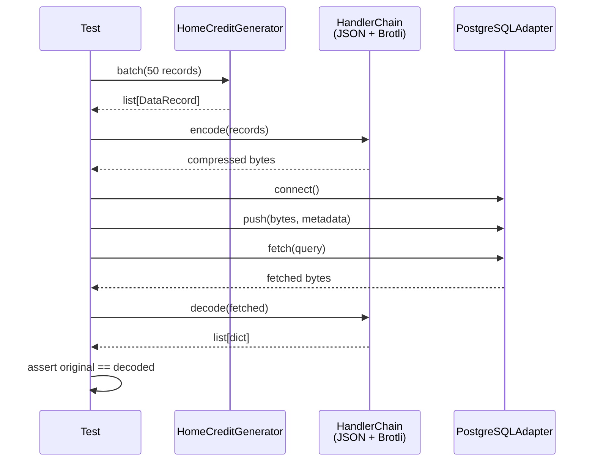

# 08. 테스트 전략

> 단위 → 통합 → E2E — 피라미드 기반의 체계적 검증

---

## 목차

1. [테스트 피라미드](#1-테스트-피라미드)
2. [단위 테스트](#2-단위-테스트)
3. [통합 테스트](#3-통합-테스트)
4. [E2E 테스트](#4-e2e-테스트)
5. [성능 벤치마크](#5-성능-벤치마크)
6. [테스트 인프라 구성](#6-테스트-인프라-구성)
7. [polyfactory 기반 테스트 픽스처](#7-polyfactory-기반-테스트-픽스처)
8. [testcontainers 기반 통합 테스트](#8-testcontainers-기반-통합-테스트)
9. [관련 문서](#9-관련-문서)

---

## 1. 테스트 피라미드

### 1.1 구조

```
          ┌─────────┐
          │  E2E    │  소수 (핵심 시나리오)
          │ 테스트   │  Docker 필요
         ─┼─────────┼─
        ┌──┴─────────┴──┐
        │   통합 테스트   │  중간 (어댑터별)
        │  Docker 필요    │  서비스 연결 검증
       ─┼───────────────┼─
      ┌──┴───────────────┴──┐
      │     단위 테스트       │  다수 (컴포넌트별)
      │   의존성 없음         │  빠른 실행
      └─────────────────────┘
```

### 1.2 비율과 목적

| 계층 | 비율 | 실행 환경 | 목적 |
|------|------|---------|------|
| **단위** | 70% | 로컬, CI | 개별 컴포넌트 정확성 |
| **통합** | 20% | Docker | 서비스 연결, 적재/조회 |
| **E2E** | 10% | Docker | 전체 파이프라인 흐름 |

---

## 2. 단위 테스트

### 2.1 테스트 대상과 검증 항목

#### Handler 단위 테스트

```
tests/unit/handlers/
├── test_formats.py           # 10종 포맷 핸들러
├── test_compression.py       # 6종 압축 핸들러
└── test_chain.py             # HandlerChain 합성
```

**포맷 핸들러 검증**:

| 검증 항목 | 방법 |
|----------|------|
| encode/decode roundtrip | `decode(encode(records)) == records` |
| 빈 리스트 처리 | `encode([])` → 에러 없이 빈 출력 |
| 타입 보존 | int, float, str, None, bool 값 왕복 정합성 |
| 대용량 레코드 | 10K 레코드 배치 처리 성공 |
| 특수 문자 | UTF-8, 개행, 따옴표 등 이스케이프 |

```python
# 파라미터화된 포맷 테스트 예시
@pytest.mark.parametrize("handler", [
    CsvFormatHandler(),
    JsonFormatHandler(),
    JsonlFormatHandler(),
    ParquetFormatHandler(),
    AvroFormatHandler(),
    # ...
])
async def test_format_roundtrip(handler, sample_records):
    encoded = await handler.encode(sample_records)
    decoded = await handler.decode(encoded)
    assert decoded == sample_records
```

**압축 핸들러 검증** (cramjam 통합):

| 검증 항목 | 방법 |
|----------|------|
| compress/decompress roundtrip | `decompress(compress(data)) == data` |
| 압축률 기준 | 구조화된 데이터에서 최소 20% 감소 |
| 빈 바이트 처리 | `compress(b"")` → 에러 없이 처리 |
| 대용량 데이터 | 10MB 데이터 처리 성공 |

```python
# cramjam 통합 압축 테스트 — 6종 알고리즘을 parametrize로 순회
@pytest.mark.parametrize("algorithm", [
    "gzip", "brotli", "snappy", "lz4", "zstd", "lzma",
])
async def test_compression_roundtrip(algorithm, sample_bytes):
    handler = CramjamCompressionHandler(algorithm)
    compressed = await handler.compress(sample_bytes)
    decompressed = await handler.decompress(compressed)
    assert decompressed == sample_bytes
```

#### Generator 단위 테스트

```
tests/unit/generators/
├── test_base.py                  # BaseGenerator 공통 동작
├── test_relational_generators.py # Category A: Relational 8종
├── test_document_generators.py   # Category B: Document 6종
├── test_event_generators.py      # Category C: Event Stream 7종
├── test_iot_generators.py        # Category D: IoT 5종
├── test_text_generators.py       # Category E: Text 3종
└── test_geospatial_generators.py # Category F: Geospatial 3종
```

| 검증 항목 | 방법 |
|----------|------|
| DataRecord 형식 | 반환 타입, 필수 필드 존재 확인 |
| batch_size 준수 | `len(batch()) == batch_size` (또는 나머지) |
| stream 비동기 | `async for record in stream()` 동작 확인 |
| seed 재현성 | 동일 seed → 동일 순서 |
| max_records 제한 | 설정된 최대 건수 초과 안 함 |
| 스키마 검증 | Pydantic 모델 통과 여부 |

#### Core 단위 테스트

```
tests/unit/core/
├── test_registry.py          # Registry 등록/생성/조회
├── test_config.py            # YAML → Pydantic 로딩
├── test_pipeline.py          # DataPipeline 오케스트레이션 (mock)
└── test_enums.py             # Enum 값 일관성
```

| 검증 항목 | 방법 |
|----------|------|
| Registry 등록 | `@register` 데코레이터로 클래스 등록 |
| Registry 생성 | `create(key)` → 올바른 인스턴스 |
| 중복 키 에러 | 같은 키 2회 등록 시 에러 |
| Config 로딩 | YAML 파일 → Pydantic 모델 변환 |
| Config 검증 | 잘못된 설정 → ValidationError |

---

## 3. 통합 테스트

### 3.1 어댑터 통합 테스트

```
tests/integration/adapters/
├── test_postgresql.py
├── test_mongodb.py
├── test_kafka.py
└── test_minio.py
```

**각 어댑터별 표준 검증 항목**:

| 검증 항목 | 방법 |
|----------|------|
| 연결 (connect) | `health_check() == True` |
| 적재 (push) | `push(data, metadata)` → 에러 없음 |
| 조회 (fetch) | `fetch(query)` → 적재된 데이터 반환 |
| 정합성 (roundtrip) | push → fetch → 원본과 비교 |
| 연결 해제 (disconnect) | 리소스 정리 확인 |
| 재연결 | disconnect 후 재 connect 성공 |
| 에러 복구 | 잘못된 데이터 push 시 적절한 에러 |

```python
# 어댑터 통합 테스트 예시
@pytest.mark.integration
async def test_postgresql_push_fetch_roundtrip(pg_adapter, sample_data):
    async with pg_adapter:
        # Push
        await pg_adapter.push(sample_data, metadata={"table": "test_table"})

        # Fetch
        result = []
        async for chunk in pg_adapter.fetch({"table": "test_table"}):
            result.append(chunk)

        # Verify
        assert len(result) > 0
        assert result[0] == sample_data
```

### 3.2 마커와 실행 분리

```ini
# pyproject.toml
[tool.pytest.ini_options]
markers = [
    "integration: requires Docker services",
]
addopts = "-m 'not integration'"  # 기본 실행 시 통합 테스트 제외
```

```bash
# 단위 테스트만 (기본)
pytest

# 통합 테스트 포함
pytest -m integration

# 전체 테스트
pytest -m ""
```

---

## 4. E2E 테스트

### 4.1 핵심 E2E 시나리오

가장 복잡한 경로를 검증하는 대표 시나리오:

```
Home Credit → JSON → Brotli → PostgreSQL
```

**이 시나리오가 핵심인 이유**:
- Home Credit: 가장 복잡한 스키마 (122열, 7테이블)
- JSON: 가장 범용적인 포맷
- Brotli: 가장 높은 압축률 (극단 케이스)
- PostgreSQL: 가장 엄격한 타입 시스템 (RDBMS)

### 4.2 E2E 테스트 흐름



### 4.3 E2E 검증 항목

```python
# tests/integration/test_e2e_home_credit_postgres.py

@pytest.mark.integration
class TestHomeCreditPostgresE2E:

    async def test_full_pipeline(self, pipeline):
        """전체 파이프라인 실행"""
        metrics = await pipeline.run_batch()

        assert metrics.total_records == 50
        assert metrics.error_count == 0
        assert metrics.records_per_second > 0
        assert metrics.elapsed_seconds > 0

    async def test_data_integrity_roundtrip(self, handler_chain, sample_records):
        """encode → decode roundtrip 정합성"""
        encoded = await handler_chain.encode(sample_records)
        decoded = await handler_chain.decode(encoded)

        for original, restored in zip(sample_records, decoded):
            assert original["sk_id_curr"] == restored["sk_id_curr"]
            assert original["amt_income_total"] == restored["amt_income_total"]

    async def test_handler_chain_compression_ratio(self, handler_chain, sample_data):
        """Brotli 압축률 검증: 구조화된 JSON에서 최소 20% 감소"""
        compressed = await handler_chain.encode(sample_data)
        raw = json.dumps(sample_data).encode()

        compression_ratio = len(compressed) / len(raw)
        assert compression_ratio < 0.80  # 최소 20% 압축
```

### 4.4 추가 E2E 시나리오 (Phase 7)

| 시나리오 | 경로 | 검증 목표 |
|---------|------|----------|
| NoSQL 문서 적재 | B1 Instacart → JSON → Zstd → MongoDB | 중첩 문서 무결성 |
| 실시간 스트리밍 | C2 IEEE Fraud → Avro → Snappy → Kafka | 이벤트 순서, 처리량 |
| 객체 저장 | A3 H&M → Parquet → LZ4 → MinIO | 대용량 파일 저장 |
| NATS 스트리밍 | C3 Twitter → JSON → Snappy → NATS JetStream | 부모 NATS 호환성 |
| DW 적재 | A4 GA Store → Parquet → Zstd → BigQuery | SQL-over-HTTP 검증 |
| SFTP 전송 | B1 Instacart → JSONL → Zstd → SFTP → MongoDB | 파일 전송 후 적재 |
| IoT 브릿지 | D5 Smart Mfg → MsgPack → Snappy → MQTT → Kafka | MQTT→Kafka 브릿지 |
| 크로스파이프라인 | A2 Olist → C5 Click → B4 Review → F1 Taxi | 커머스 풀스택 연계 |

### 4.5 크기 Tier별 테스트 전략

| Tier | 크기 | 테스트 유형 | 실행 환경 | 주기 |
|------|------|-----------|---------|------|
| **Micro** (< 10MB) | A6, A8, B2 | 단위 + 통합 | CI (매 커밋) | 항상 |
| **Small** (10~200MB) | A2, C1, D4 | 통합 | CI (PR) | PR마다 |
| **Medium** (200MB~2GB) | B1, C2, B6 | 통합 + E2E | Docker | 일간 |
| **Large** (2~5GB) | A1, A3, E1 | 스트레스 | Docker | 주간 |
| **XL** (5GB+) | F1, B5, D1 | 한계 테스트 | Docker + 고메모리 | 릴리스 전 |

---

## 5. 성능 벤치마크

### 5.1 벤치마크 목표

| 지표 | 목표 | 측정 방법 |
|------|------|---------|
| **처리량 (Batch)** | 10K+ records/sec | H&M 데이터로 배치 적재 시간 |
| **지연시간 (Stream)** | < 10ms/record | IEEE Fraud 1건 발행 시간 |
| **압축률** | 포맷별 기준 충족 | 각 포맷+압축 조합의 비율 |
| **메모리 사용** | < 500MB (배치 1K) | 파이프라인 실행 중 RSS |
| **연결 안정성** | 1시간+ 무중단 | 장기 실행 테스트 |

### 5.2 벤치마크 매트릭스

```
벤치마크 = 데이터셋 × 포맷 × 압축 × 어댑터 × 배치크기

핵심 조합 (Phase 7 목표):
  A3 H&M × Parquet × LZ4 × MSSQL × {1K, 10K, 100K}
  C2 IEEE Fraud × Avro × Snappy × Kafka × {100, 500, 1K}
  F1 NYC Taxi × Parquet × Zstd × Elasticsearch × {1K, 10K}
  D1 Bosch × MsgPack × LZ4 × MQTT × {100, 500}
  C5 Clickstream × Avro × Snappy × Kafka × {1K, 10K}
  A4 GA Store × JSON × Gzip × BigQuery × {1K, 10K}
  C3 Twitter × JSON × Snappy × NATS × {500, 1K}
  B5 Yelp × JSON × Zstd × MongoDB × {1K, 10K}
```

### 5.3 병목 측정 방법

```python
# PipelineMetrics에서 병목 식별
metrics = await pipeline.run_batch()

print(f"Generation:   {metrics.generation_time_ms:.1f} ms")
print(f"Encoding:     {metrics.encoding_time_ms:.1f} ms")
print(f"Compression:  {metrics.compression_time_ms:.1f} ms")
print(f"Push:         {metrics.push_time_ms:.1f} ms")
print(f"---")
print(f"Total:        {metrics.elapsed_seconds:.2f} s")
print(f"Throughput:   {metrics.records_per_second:.0f} rec/s")
print(f"Compression:  {metrics.compression_ratio:.2%}")
```

---

## 6. 테스트 인프라 구성

### 6.1 디렉토리 구조

```
tests/
├── conftest.py               # 공통 fixture
├── unit/
│   ├── conftest.py           # 단위 테스트 fixture
│   ├── core/
│   │   ├── test_registry.py
│   │   ├── test_config.py
│   │   └── test_pipeline.py
│   ├── handlers/
│   │   ├── test_formats.py
│   │   ├── test_compression.py
│   │   └── test_chain.py
│   └── generators/
│       ├── test_relational_generators.py   # Category A (8종)
│       ├── test_document_generators.py     # Category B (6종)
│       ├── test_event_generators.py        # Category C (7종)
│       ├── test_iot_generators.py          # Category D (5종)
│       ├── test_text_generators.py         # Category E (3종)
│       └── test_geospatial_generators.py   # Category F (3종)
└── integration/
    ├── conftest.py           # Docker fixture
    ├── adapters/
    │   ├── test_postgresql.py
    │   ├── test_mongodb.py
    │   ├── test_kafka.py
    │   ├── test_minio.py
    │   ├── test_nats.py          # 신규
    │   ├── test_bigquery.py      # 신규
    │   ├── test_ftp.py           # 신규
    │   └── test_sftp.py          # 신규
    └── e2e/
        ├── test_e2e_home_credit_postgres.py
        ├── test_e2e_twitter_nats.py       # 신규
        ├── test_e2e_ga_bigquery.py        # 신규
        └── test_e2e_instacart_sftp.py     # 신규
```

### 6.2 pytest 설정

```toml
# pyproject.toml
[tool.pytest.ini_options]
testpaths = ["tests"]
asyncio_mode = "auto"
markers = [
    "integration: requires Docker services (deselect with '-m \"not integration\"')",
    "testcontainers: requires Docker for testcontainers-managed services",
    "benchmark: performance benchmark tests",
    "slow: tests that take > 30 seconds",
]
addopts = "-m 'not integration' --import-mode=importlib"
```

### 6.3 CI 파이프라인 (개념)

```
Stage 1: 단위 테스트 (Docker 불필요)
  ├─ pytest tests/unit/
  ├─ ruff check + format
  └─ 커버리지 보고

Stage 2: 통합 테스트 (Docker 필요)
  ├─ docker compose up -d
  ├─ 헬스체크 대기
  ├─ pytest -m integration
  └─ docker compose down -v
```

---

## 7. polyfactory 기반 테스트 픽스처

32종 Pydantic 스키마에 대한 테스트 데이터를 자동 생성하기 위해 **polyfactory**를 도입한다. 수동 픽스처 작성을 제거하고, 스키마 변경 시 자동 반영된다.

### 7.1 ModelFactory 패턴

```python
from polyfactory.factories.pydantic_factory import ModelFactory
from demiurge_testdata.schemas.datasets.home_credit import HomeCreditSchema

class HomeCreditFactory(ModelFactory):
    __model__ = HomeCreditSchema

# 사용
record = HomeCreditFactory.build()          # 단건 생성
batch = HomeCreditFactory.batch(size=100)   # 배치 생성
```

### 7.2 디렉토리 구조

```
tests/factories/
├── __init__.py
├── relational.py      # Category A: 8종 스키마 팩토리
├── document.py        # Category B: 6종 스키마 팩토리
├── event.py           # Category C: 7종 스키마 팩토리
├── iot.py             # Category D: 5종 스키마 팩토리
├── text.py            # Category E: 3종 스키마 팩토리
└── geospatial.py      # Category F: 3종 스키마 팩토리
```

---

## 8. testcontainers 기반 통합 테스트

어댑터별 통합 테스트를 **testcontainers-python**으로 격리한다. Docker Compose는 E2E/개발 환경으로, testcontainers는 어댑터별 통합 테스트용으로 역할을 분담한다.

### 8.1 커버리지

| 카테고리 | 네이티브 모듈 | GenericContainer |
|---------|-------------|-----------------|
| **RDBMS** | `PostgresContainer`, `MySqlContainer`, `OracleDbContainer` | MariaDB, MSSQL, CockroachDB, BigQuery Emulator |
| **NoSQL** | `MongoDbContainer`, `RedisContainer` | Elasticsearch, Cassandra |
| **Streaming** | `KafkaContainer`, `RabbitMqContainer`, `NatsContainer` | MQTT (Mosquitto), Pulsar |
| **Storage** | `MinioContainer` | — |
| **FileTransfer** | — | FTP (vsftpd), SFTP (atmoz/sftp) |

### 8.2 pytest fixture 패턴

```python
import pytest
from testcontainers.postgres import PostgresContainer
from testcontainers.kafka import KafkaContainer

@pytest.fixture(scope="session")
def postgres_container():
    with PostgresContainer("postgres:16-alpine") as pg:
        yield pg

@pytest.fixture
async def pg_adapter(postgres_container):
    config = RDBMSAdapterConfig(
        host=postgres_container.get_container_host_ip(),
        port=postgres_container.get_exposed_port(5432),
        user="test", password="test", database="test",
    )
    adapter = PostgreSQLAdapter(config)
    async with adapter:
        yield adapter
```

### 8.3 역할 분담

| 도구 | 용도 | 실행 환경 |
|------|------|---------|
| **testcontainers** | 어댑터별 통합 테스트 (격리) | CI, 로컬 `pytest -m integration` |
| **Docker Compose** | E2E 테스트, 개발 환경 | 로컬 `docker compose up` |
| **FastStream TestBroker** | 스트리밍 단위 테스트 (Docker 불필요) | CI, 로컬 `pytest` |

---

## 9. 관련 문서

| 문서 | 내용 |
|------|------|
| [02-데이터-흐름](./02-데이터-흐름.md) | E2E에서 검증하는 파이프라인 흐름 |
| [04-핸들러-설계](./04-핸들러-설계.md) | roundtrip 테스트 대상 핸들러 |
| [03-어댑터-설계](./03-어댑터-설계.md) | 통합 테스트 대상 어댑터 |
| [06-인프라-구성](./06-인프라-구성.md) | 테스트용 Docker Compose 환경 |
| [09-구현-로드맵](./09-구현-로드맵.md) | Phase별 테스트 구현 일정 |
