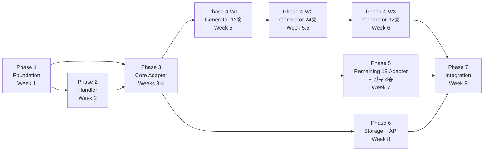

# 09. 구현 로드맵

> 7단계 마일스톤 — Foundation부터 Integration까지

---

## 목차

1. [단계별 마일스톤](#1-단계별-마일스톤)
2. [우선순위 근거](#2-우선순위-근거)
3. [의존성 그래프](#3-의존성-그래프)
4. [리스크와 대응 방안](#4-리스크와-대응-방안)
5. [관련 문서](#5-관련-문서)

---

## 1. 단계별 마일스톤

### Phase 1: Foundation (Week 1)

**목표**: 프로젝트 스켈레톤과 핵심 인프라 코드 확립

**산출물**:

| 카테고리 | 파일 | 설명 |
|---------|------|------|
| **프로젝트 설정** | `pyproject.toml` | 패키지 메타, 의존성, optional groups |
| | `Makefile` | 빌드/테스트/린트 자동화 커맨드 |
| | `.gitignore` | Python, IDE, 데이터 파일 제외 |
| | `ruff.toml` | 린팅/포매팅 규칙 |
| **Core** | `core/registry.py` | Generic Registry 클래스 |
| | `core/config.py` | YAML → Pydantic 설정 로더 |
| | `core/pipeline.py` | DataPipeline 오케스트레이터 |
| | `core/enums.py` | AdapterType, FormatType 등 Enum |
| | `core/exceptions.py` | 프로젝트 공통 예외 계층 |
| **Schema** | `schemas/record.py` | DataRecord 모델 |
| | `schemas/config.py` | PipelineConfig, GeneratorConfig 등 |
| **ABC** | `generators/base.py` | BaseGenerator ABC |
| | `handlers/base.py` | BaseFormatHandler, BaseCompressionHandler ABC |
| | `handlers/chain.py` | HandlerChain 합성기 |
| | `adapters/base.py` | BaseAdapter, Category Base ABCs |
| **테스트** | `tests/unit/core/` | Registry, Config, Pipeline 단위 테스트 |

**의존성**: `pydantic>=2.0`, `pyyaml`, `pytest>=8.0`, `pytest-asyncio>=0.24`, `ruff>=0.8`

**완료 기준**:
- `pytest tests/unit/core/` 전체 통과
- `ruff check` + `ruff format --check` 통과
- Registry에 데코레이터 등록/생성 동작 확인

---

### Phase 2: Handler Layer (Week 2)

**목표**: 10종 포맷 핸들러 + 6종 압축 핸들러 구현

**산출물**:

| 카테고리 | 파일 수 | 설명 |
|---------|--------|------|
| **포맷 핸들러** | 10개 | CSV, JSON, JSONL, Parquet, Avro, ORC, MsgPack, Arrow, XML, YAML |
| **압축 핸들러** | 6개 | Gzip, Brotli, Snappy, LZ4, Zstd, LZMA |
| **테스트** | 3개 | test_formats.py, test_compression.py, test_chain.py |

**추가 의존성**: `pyarrow`, `fastavro`, `orjson`, `msgspec`, `cramjam`, `lxml`

**완료 기준**:
- 10종 포맷 모두 encode/decode roundtrip 통과
- 6종 압축 모두 compress/decompress roundtrip 통과
- HandlerChain 조합 테스트 (최소 10개 조합) 통과
- 모든 압축에서 구조화된 데이터 최소 20% 크기 감소

---

### Phase 3: Core Adapters + Docker (Weeks 3-4)

**목표**: 카테고리별 대표 어댑터 4종 + Docker Compose 인프라

**산출물**:

| 카테고리 | 구현체 | 드라이버 |
|---------|--------|---------|
| **RDBMS** | PostgreSQLAdapter | `asyncpg`, `sqlalchemy[asyncio]` |
| **NoSQL** | MongoDBAdapter | `motor` |
| **Streaming** | KafkaAdapter | `faststream[kafka]` |
| **Storage** | S3Adapter (MinIO) | `fsspec`, `s3fs`, `universal-pathlib` |
| **인프라** | `docker-compose.yml` | 5개 서비스 |
| **테스트** | 통합 테스트 4종 | 어댑터별 connect/push/fetch |

**추가 의존성**: `asyncpg`, `sqlalchemy[asyncio]`, `motor`, `faststream[kafka]`, `fsspec`, `s3fs`, `universal-pathlib`

**완료 기준**:
- `docker compose up -d` → 5개 서비스 모두 healthy
- PostgreSQL push/fetch roundtrip 통과
- MongoDB insert/query roundtrip 통과
- Kafka publish/subscribe 동작 확인
- MinIO write/read roundtrip 통과

---

### Phase 4: Generators — Wave 1 (Week 5)

**목표**: 핵심 12종 제너레이터 (각 카테고리 대표 2종) + Pydantic 스키마

**산출물**:

| 카테고리 | 구현체 (Wave 1) |
|---------|--------|
| **Relational (A)** | HomeCreditGenerator (A1), OlistGenerator (A2) |
| **Document (B)** | InstacartGenerator (B1), TmdbGenerator (B2) |
| **Event (C)** | StoreSalesGenerator (C1), IeeFraudGenerator (C2) |
| **IoT (D)** | BoschGenerator (D1), ElectricPowerGenerator (D3) |
| **Text (E)** | StackOverflowGenerator (E1) |
| **Geospatial (F)** | NycTaxiGenerator (F1), DataCoGenerator (F3) |
| **스키마** | 12종 Pydantic v2 모델 |
| **유틸** | Kaggle 다운로드 스크립트 |

**완료 기준**:
- 12종 제너레이터 Batch/Stream/API 3가지 모드 동작
- Pydantic strict 검증 모드에서 에러 없음 (샘플 데이터)
- seed 재현성 테스트 통과

### Phase 4-W2: Generators — Wave 2 (Week 5.5)

**목표**: 중간 우선순위 12종 추가 (총 24종)

| 카테고리 | 구현체 (Wave 2) |
|---------|--------|
| **Relational (A)** | HmGenerator (A3), GaStoreGenerator (A4), FraudTransGenerator (A5), ChinookGenerator (A6) |
| **Document (B)** | AirbnbGenerator (B3), AmazonReviewsGenerator (B4) |
| **Event (C)** | TwitterSentimentGenerator (C3), CcFraudGenerator (C4), ClickstreamGenerator (C5) |
| **IoT (D)** | WeatherGenerator (D2), SmartMfgGenerator (D5) |
| **Text (E)** | EnronEmailGenerator (E2) |

### Phase 4-W3: Generators — Wave 3 (Week 6)

**목표**: 나머지 8종 완성 (총 32종)

| 카테고리 | 구현체 (Wave 3) |
|---------|--------|
| **Relational (A)** | EuroSoccerGenerator (A7), NorthwindGenerator (A8) |
| **Document (B)** | YelpGenerator (B5), FoodComGenerator (B6) |
| **Event (C)** | NetworkTrafficGenerator (C6), BitcoinGenerator (C7) |
| **IoT (D)** | AppliancesEnergyGenerator (D4) |
| **Text (E)** | GitHubMetadataGenerator (E3) |
| **Geospatial (F)** | GeoLifeGenerator (F2) |

**추가 의존성**: `pandas`, `kaggle`

**완료 기준**:
- 32종 제너레이터 모두 Batch/Stream/API 동작
- Pydantic strict 검증 모드에서 에러 없음 (샘플 데이터)
- seed 재현성 테스트 통과

---

### Phase 5: Remaining Adapters (Week 7)

**목표**: 나머지 18개 어댑터 구현 (기존 14종 + 신규 4종)

**산출물**:

| 카테고리 | 구현체 |
|---------|--------|
| **RDBMS** | MySQL, MariaDB, MSSQL, Oracle, SQLite, CockroachDB, **BigQuery** |
| **NoSQL** | Elasticsearch, Redis, Cassandra |
| **Streaming** | RabbitMQ, MQTT, Pulsar, **NATS JetStream** |
| **Storage** | LocalFSAdapter, HDFSAdapter |
| **FileTransfer** | **FTPAdapter**, **SFTPAdapter** |
| **테스트** | 어댑터별 통합 테스트 |

**추가 의존성**: `aiomysql`, `aioodbc`, `oracledb`, `aiosqlite`, `elasticsearch[async]`, `redis[hiredis]`, `cassandra-driver`, `faststream[rabbit,nats]`, `aiomqtt`, `pulsar-client`, `google-cloud-bigquery`, `paramiko`

**완료 기준**:
- 18개 어댑터 모두 connect/push/fetch 동작 (Docker 사용 가능한 것)
- SQLite: Docker 없이 로컬 파일로 동작
- LocalFS: Docker 없이 로컬 디렉토리로 동작
- NATS JetStream: 부모 Demiurge NATS 호환성 확인
- BigQuery 에뮬레이터: SQL-over-HTTP 동작 확인
- FTP/SFTP: 파일 업로드/다운로드 동작 확인
- Registry에 22개 어댑터 모두 등록 확인

---

### Phase 6: Storage + API (Week 7)

**목표**: 스토리지 추상화 레이어 + gRPC/REST API 서빙

**산출물**:

| 카테고리 | 파일 | 설명 |
|---------|------|------|
| **Storage** | `storage/backend.py` | StorageBackend ABC, 위치 투명성 |
| **gRPC** | `protos/testdata/v1/` | Protobuf 정의 |
| | `api/grpc/server.py` | gRPC 서버 구현 |
| **REST** | `api/rest/app.py` | FastAPI REST 서버 |
| **CLI** | `__main__.py` | 커맨드라인 진입점 |

**추가 의존성**: `grpcio`, `grpcio-tools`, `protobuf`, `fastapi`, `uvicorn`

**완료 기준**:
- gRPC 서버에서 데이터 페이지네이션 요청/응답 동작
- REST API에서 파이프라인 실행 트리거 동작
- CLI에서 `python -m demiurge_testdata run --config pipeline.yaml` 동작

---

### Phase 7: Integration + Polish (Week 8)

**목표**: 전체 E2E 테스트, 설정 파일, 문서화 완성

**산출물**:

| 카테고리 | 설명 |
|---------|------|
| **E2E 테스트** | A1 Home Credit → PostgreSQL, B1 Instacart → MongoDB, C2 IEEE Fraud → Kafka, A3 H&M → MinIO, C3 Twitter → NATS, A4 GA Store → BigQuery, B1 Instacart → SFTP → MongoDB, D5 Smart Mfg → MQTT → Kafka |
| **YAML 설정** | 32종 데이터셋 × 주요 어댑터 파이프라인 설정 |
| **벤치마크** | 핵심 조합 성능 측정, 결과 기록 |
| **문서** | README.md, CLAUDE.md, API 문서 |

**완료 기준**:
- E2E 4종 시나리오 모두 통과
- 처리량 목표 달성 (10K+ records/sec for batch)
- README에 설치·실행·설정 가이드 완성

---

## 2. 우선순위 근거

### 2.1 왜 Foundation → Handler → Core Adapter 순서인가

```
Phase 1 (Foundation)
  │  Registry, Config, Pipeline ABC가 없으면
  │  다른 모든 컴포넌트를 만들 수 없다.
  ▼
Phase 2 (Handler)
  │  포맷/압축이 없으면 데이터를 변환할 수 없다.
  │  어댑터보다 먼저: bytes를 만들어야 push할 수 있다.
  ▼
Phase 3 (Core Adapter + Docker)
  │  핵심 4종 어댑터로 파이프라인 동작 검증.
  │  Docker Compose로 실제 인프라 연결.
  ▼
Phase 4 (Generator — Wave 1/2/3)
  │  이제 실제 데이터로 파이프라인을 구동할 수 있다.
  │  Handler + Adapter가 있으므로 즉시 E2E 가능.
  │  32종을 3단계 Wave로 분할: 12종 → 24종 → 32종
  ▼
Phase 5 (Remaining 18 Adapters + 신규 4종)
  │  핵심 구조가 검증된 후 나머지 어댑터 확장.
  │  Category Base 덕분에 빠르게 추가 가능.
  │  BigQuery, NATS, FTP, SFTP 4종 신규 포함.
  ▼
Phase 6 (Storage + API)
  │  내부 파이프라인이 완성된 후 외부 인터페이스 추가.
  ▼
Phase 7 (Integration + Polish)
  │  전체 통합 검증과 마무리.
```

### 2.2 핵심 원칙

1. **안쪽에서 바깥으로**: Core → Schema → Generator/Handler/Adapter → API
2. **추상 먼저, 구체 나중**: ABC를 먼저 확정하고 구현체를 추가
3. **검증 가능한 단위**: 각 Phase가 끝나면 독립적으로 테스트 가능
4. **점진적 통합**: Phase 3부터 실제 인프라와 연결하여 조기 검증

---

## 3. 의존성 그래프

### 3.1 Phase 간 의존 관계



### 3.2 병렬 가능 구간

| 구간 | 병렬 가능 작업 |
|------|-------------|
| Weeks 3-4 | 어댑터 구현과 Docker Compose 동시 진행 |
| Week 5-6 | Generator(P4)와 Remaining Adapter(P5)는 약한 의존만 → 순차 권장 |
| Week 7 | Storage + API 병렬 구현 가능 |

---

## 4. 리스크와 대응 방안

### 4.1 기술 리스크

| 리스크 | 확률 | 영향 | 대응 |
|--------|------|------|------|
| **Kaggle 데이터 접근 제한** | 중 | 높음 | 다운로드 스크립트 사전 작성, 샘플 데이터 생성기 |
| **드라이버 호환성 문제** | 높음 | 중 | Optional dependency groups, CI 매트릭스, 문제 드라이버 Phase 5로 연기 |
| **대규모 데이터 메모리 부족** | 중 | 높음 | 청크 읽기, 배치 크기 제한, 스트리밍 모드 활용 |
| **asyncio CPU 병목** | 중 | 중 | `asyncio.to_thread()`, ProcessPoolExecutor |
| **Docker 리소스 부족** | 낮음 | 중 | 서비스 선택적 실행, 리소스 제한 설정 |

### 4.2 일정 리스크

| 리스크 | 확률 | 영향 | 대응 |
|--------|------|------|------|
| **Phase 3 지연** (어댑터 4종) | 중 | 높음 | PostgreSQL + MinIO 우선, MongoDB/Kafka는 1주 여유 |
| **Phase 5 범위 초과** (14개 어댑터) | 높음 | 중 | 핵심 6종 우선, 나머지는 후속 작업으로 |
| **Phase 6 복잡도** (gRPC + REST) | 중 | 중 | REST 우선 (FastAPI), gRPC는 기본만 |

### 4.3 의존성별 설치 전략

드라이버 문제 최소화를 위한 Optional Groups:

```toml
# pyproject.toml
[project.optional-dependencies]
handlers = ["orjson", "cramjam", "msgspec"]
rdbms = ["asyncpg", "sqlalchemy[asyncio]", "aiomysql", "aioodbc", "oracledb", "aiosqlite", "google-cloud-bigquery"]
nosql = ["motor", "elasticsearch[async]", "redis[hiredis]", "cassandra-driver"]
streaming = ["faststream[kafka,rabbit,nats]", "aiomqtt", "pulsar-client"]
storage = ["fsspec", "s3fs", "universal-pathlib"]
filetransfer = ["fsspec", "paramiko"]
api = ["grpcio", "grpcio-tools", "protobuf", "fastapi", "uvicorn"]
all = ["demiurge-testdata[handlers,rdbms,nosql,streaming,storage,filetransfer,api]"]
dev = ["pytest>=8.0", "pytest-asyncio>=0.24", "ruff>=0.8", "testcontainers[postgres,mongodb,kafka,redis,elasticsearch,rabbitmq,nats,minio]", "polyfactory"]
```

---

## 5. 관련 문서

| 문서 | 내용 |
|------|------|
| [00-프로젝트-개요](./00-프로젝트-개요.md) | 프로젝트 범위와 기술 스택 |
| [01-시스템-아키텍처](./01-시스템-아키텍처.md) | 구현할 계층 구조 |
| [06-인프라-구성](./06-인프라-구성.md) | Phase 3의 Docker Compose 상세 |
| [08-테스트-전략](./08-테스트-전략.md) | 각 Phase의 테스트 범위 |
